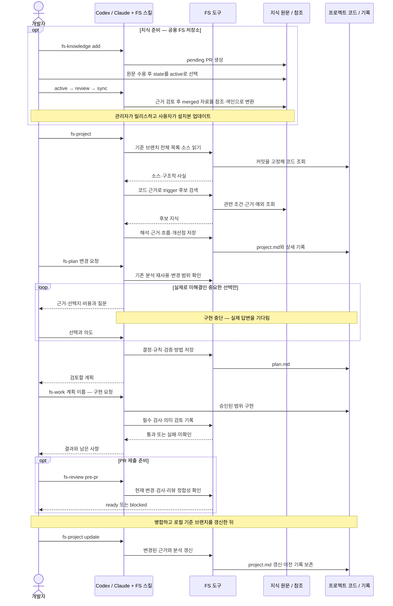
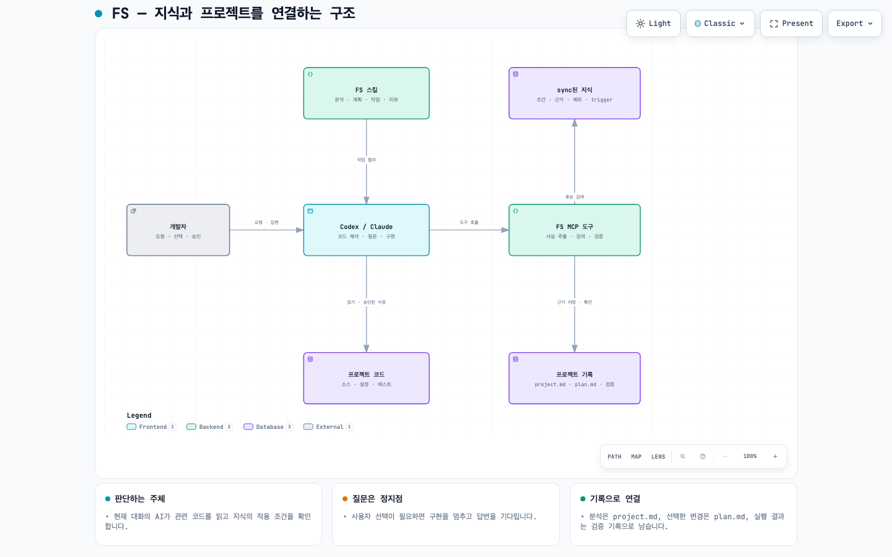

# Frontend System

FS는 저장한 지식을 프로젝트 코드와 연결해 **분석 → 질문과 결정 → 계획 → 구현과 검증**을 돕는 Codex·Claude Code 플러그인입니다. 코드를 해석하는 주체는 현재 대화의 AI이며, FS는 지식 검색과 근거·결정·검증 기록을 제공합니다.

## 설치와 업데이트

Node.js와 Git, 사용할 클라이언트의 CLI가 필요합니다. **이 절의 명령은 일반 터미널에서 실행**합니다. FS 저장소를 직접 clone하거나 프로젝트에 npm 의존성을 추가할 필요는 없습니다. 설치는 사용자 단위로 한 번만 하면 됩니다.

### Codex

```bash
codex plugin marketplace add Yelihi/frontend-system --ref release
codex plugin add frontend-system@frontend-system
codex plugin list --marketplace frontend-system --json
```

마지막 출력에서 설치 여부와 버전이 `0.4.0` 이상인지 확인합니다. 설치 후 Codex 앱을 다시 시작하거나 새 CLI 세션을 열고, 대상 프로젝트의 대화창에 `$fs-project`를 입력합니다.

새 릴리스로 업데이트할 때:

```bash
codex plugin marketplace upgrade frontend-system
codex plugin list --marketplace frontend-system --json
```

설치본이 이전 버전으로 남아 있으면 다음 명령으로 재설치한 뒤 새 세션을 시작합니다.

```bash
codex plugin remove frontend-system@frontend-system
codex plugin add frontend-system@frontend-system
```

명령 지원 여부는 `codex plugin --help`에서 확인할 수 있습니다. [공식 Codex CLI 안내](https://learn.chatgpt.com/docs/cli/reference#codex-plugin).

### Claude Code

```bash
claude plugin marketplace add Yelihi/frontend-system
claude plugin install frontend-system@frontend-system --scope user
claude plugin list
```

설치 후 대상 프로젝트에서 새 Claude Code 세션을 열고 `/frontend-system:fs-project`를 입력합니다. [공식 설치 안내](https://code.claude.com/docs/en/discover-plugins).

새 릴리스로 업데이트할 때:

```bash
claude plugin marketplace update frontend-system
claude plugin update frontend-system@frontend-system --scope user
claude plugin list
```

업데이트한 플러그인을 사용하는 새 세션을 시작하세요. 두 클라이언트 모두 이 저장소의 **`release` 브랜치에 배포된 플러그인**을 설치합니다. main의 개발 변경이나 지식 sync만으로 배포본이 바뀌지는 않습니다.

## 명령어

**대상 프로젝트를 연 Codex·Claude 대화창에 입력합니다. 아래 `fs-*`는 터미널 명령이 아닙니다.** Codex에서는 `$fs-project`처럼 스킬을 선택해도 됩니다. 경로를 생략하면 현재 프로젝트를 사용합니다.

| 명령어 | 하는 일 |
| --- | --- |
| `fs-project` | 프로젝트 전체를 분석해 `.frontend-system/project.md` 생성. 이미 있으면 위치와 최신 상태 안내 |
| `fs-project update` | 기준 브랜치의 변경을 확인해 분석 갱신. 기존 결정과 이력 보존 |
| `fs-plan <요청>` | 분석과 지식을 참고하고 필요한 선택을 질문한 뒤 `plan.md` 작성. 구현하지 않음 |
| `fs-work <계획 이름>` | 합의된 계획을 구현하고 필수 검사 실행. 미해결 선택이 생기면 멈추고 질문 |
| `fs-plan-visualize <페이지나 흐름>` | 실제 코드의 컴포넌트·이벤트·상태 흐름을 HTML로 시각화 |
| `fs-review <대상>` | 코드나 오류를 검토하고 근거·개선안 제시. 코드 수정은 별도 요청 |
| `fs-review pr <PR URL>` | PR 댓글과 코드에서 의도·적용 조건·반례 검토 |
| `fs-review pr <PR URL> learn` | 검토한 지식 후보와 확인된 결정을 해당 프로젝트에 기록 |
| `fs-review pre-pr --base origin/main --plan <계획 이름>` | 버그·보안, 요구사항·범위, 필수 검사와 리뷰를 확인해 PR 준비 여부 판정 |
| `fs-knowledge add <메모 또는 URL>` | 지식을 정리해 **공식 FS 저장소에 pending PR 생성**. GitHub 인증 필요 |
| `fs-knowledge active` | 관리자가 `state: active`로 선택한 원문을 모아 구조화 |
| `fs-knowledge review` | 선택된 원문의 근거·조건·예외 검토. 유효한 승인을 받은 지식은 merged로 판단 |
| `fs-knowledge sync` | merged 지식의 미반영 변경을 참조 문서·검색 색인·trigger로 변환 |

`active`, `review`, `sync`는 **FS 원본 저장소에서 관리자가 실행**합니다. `merged`는 검토 결과에서 계산하므로 metadata에 직접 쓰지 않습니다. 프로젝트의 PR 리뷰를 공유 지식으로 바로 승격하지 않으며, sync 후 배포·설치본 업데이트는 별도입니다.

`fs-project --base develop`처럼 기준 브랜치를 지정할 수 있습니다. 처음에는 로컬 `main`, 이후에는 기존 분석의 기준 브랜치를 사용합니다. **미병합 작업 브랜치와 미커밋 변경은 project.md의 기준 사실에 섞지 않습니다.** 기준 브랜치가 없는 신규 프로젝트는 `fs-plan`으로 요구사항부터 논의합니다.

> `fs-project`와 질문 대기 절차는 **0.4.0 이상**에서 제공합니다. 이전 설치본은 플러그인을 업데이트하고 새 세션에서 사용하세요.

## 예시: 주문 관리 프로젝트에서 사용하기

아래는 대화 예시입니다. 실제 결론과 질문은 프로젝트 코드·기존 결정·설치된 지식에 따라 달라집니다.

### 1. 전체 프로젝트 분석

프로젝트 폴더에서 새 대화를 열고 입력합니다.

```text
fs-project
```

FS는 환경·의존성·배포 설정 → 폴더와 의존 방향 → 페이지별 이벤트·상태·오류 흐름 → 관련 지식과 개선 후보 순으로 분석합니다. 모든 기준 파일의 확인 여부를 기록하며, 확인하지 못한 영역은 미확인으로 남깁니다.

결과는 `.frontend-system/project.md`입니다. 전체 설명과 상세 근거·흐름·개선 후보의 링크를 제공합니다. 분석만으로 제품 코드를 수정하지 않습니다.

### 2. 변경 계획과 질문

```text
fs-plan 주문 저장 흐름을 정리해주세요.
기능과 화면은 유지하고, 중복 요청과 오류 처리 책임을 명확히 하고 싶습니다.
계획 이름은 order-save로 해주세요.
```

FS가 코드에서 답을 찾지 못한 중요한 선택은 다음처럼 묻습니다.

> 현재 저장 실패 후 재시도 정책은 없고, 서버의 중복 방지 계약도 확인되지 않았습니다.
> 실패한 주문 저장을 어떻게 처리할까요?
>
> 1. 자동 재시도 없이 오류를 표시하고 사용자가 다시 요청하게 한다.
> 2. 서버의 중복 방지 지원을 확인한 뒤 자동 재시도 정책을 설계한다.
>
> 확인 전에는 1번을 권장합니다. **답변을 기다리며 구현을 멈춥니다.**

사용자가 답합니다.

```text
1번으로 하겠습니다. 실패하면 입력값을 유지하고 오류를 표시해주세요.
자동 재시도는 이번 범위에서 제외합니다.
```

필요한 선택이 정리되면 `.frontend-system/plans/order-save/plan.md`에 변경 범위, 지켜야 할 규칙, 제외 사항, 검증 방법을 저장합니다. 답변 대기 중에는 추천안을 임의로 선택하지 않습니다. 이미 답한 내용은 조건이 같으면 다시 묻지 않습니다.

### 3. 계획대로 구현

계획을 읽은 뒤 요청합니다.

```text
fs-work order-save
이 계획대로 구현해주세요.
```

FS는 해당 계획을 기준으로 구현하고 검증합니다. 합의된 범위 안의 작업은 계속 진행하며, 새로운 도메인 선택이 필요하면 **코드 수정을 멈추고 질문한 뒤 실제 답변을 기다립니다.** 접근 권한이나 자동 실행 설정은 설계 질문의 답변을 대신하지 않습니다.

추가 변경도 먼저 계획에 반영합니다.

```text
fs-plan order-save 계획을 수정해주세요.
오류가 발생하면 첫 번째 오류 필드로 포커스를 이동하도록 추가하고 싶습니다.
```

### 4. 실제 흐름 확인과 PR 전 검토

```text
fs-plan-visualize 주문 페이지에서 저장 버튼을 누른 뒤 성공하거나 실패하는 흐름
```

실제 코드를 따라 만든 HTML 경로를 받습니다. 브라우저에서 열어 이벤트에 따른 함수 호출과 상태 변화를 확인합니다.

PR 제출을 위한 검토를 요청합니다. 계획에 필요한 리뷰 의무가 없으면 먼저 계획에 반영하며, 최종 리뷰는 의도한 변경이 커밋된 상태에 연결합니다.

```text
fs-review pre-pr --base origin/main --plan order-save
```

누락되거나 실패한 필수 검사, 오래된 리뷰, 검토하지 않은 변경 파일이 있으면 FS의 PR 제출 절차를 차단합니다. 이 명령 자체가 커밋하거나 PR을 만들지는 않습니다. GitHub 웹 등 다른 경로의 PR 생성까지 막지는 않습니다.

리뷰 댓글에서 배울 부분이 있으면 다음처럼 요청합니다.

```text
fs-review pr https://github.com/owner/orders/pull/42 learn
```

댓글을 정답으로 가정하지 않고 재사용 가능·프로젝트 한정·정보 부족·부적절한 주장으로 구분합니다. 애매한 의도는 질문하고, 공유 지식으로 추가하는 것은 별도로 결정합니다.

### 5. 만족한 결과를 기준 분석에 반영

변경을 기준 브랜치에 병합하고 로컬에도 반영한 뒤 요청합니다.

```text
fs-project update
```

변경된 코드와 영향을 받는 흐름을 다시 확인하고 project.md를 갱신합니다. 해결된 개선점은 활성 목록에서 정리하되 이력은 보존합니다. 구현 직후 자동으로 기준 분석을 덮어쓰지 않습니다.

### 6. 배운 지식 추가

공유하려는 지식은 출처와 적용 조건을 함께 전달합니다.

```text
fs-knowledge add
출처: 제가 작성한 주문 저장 회고
배운 점: 부작용 요청의 자동 재시도는 서버의 중복 방지 계약을 먼저 확인해야 한다.
적용 상황: 네트워크 실패 후 같은 요청을 다시 보낼 때.
예외: 서버가 동일 요청임을 판별하고 중복 처리를 막는 계약이 확인된 경우.
```

이 명령은 공유 PR을 만듭니다. 비공개 프로젝트 내용은 제거하고, 공유하지 않을 메모라면 **로컬 전용 저장과 대상 FS 원본 저장소를 명시**하세요. 원문 양식은 [지식 템플릿](knowledge/source/template.md)을 참고합니다.

## FS 전체 시퀀스



## FS 구조



[확대 가능한 구조도 HTML](docs/diagrams/fs-overview.html) · [그림의 근거와 검증 기록](docs/diagrams/README.md#fs-전체-구조)

AI가 관련 코드를 해석하고, 도구가 관찰 가능한 특징과 지식 후보를 연결합니다. **trigger는 검토를 시작하는 조건이며 자동 수정 명령이 아닙니다.** AI가 지식의 조건·예외와 실제 코드·기존 결정을 대조한 뒤 적용하거나 제외하고, 필요한 선택만 질문합니다.

| 위치 | 역할 |
| --- | --- |
| `skills/` | 사용자가 호출하는 분석·계획·작업·리뷰·지식 명령 |
| `knowledge/source/` | 출처와 적용 조건을 담은 원문. 관리자가 검토 대상으로 선택 |
| `references/learned/` · `references/learned/index.json` | sync한 지식 본문과 검색 색인 |
| `mandatory-rules/` · `references/workflows/` | 기본 규칙과 명령별 절차 |
| `src/mcp.ts` · `src/application/` | 파일·근거·검색·계획·실행 검증 도구 |
| 대상 프로젝트의 `.frontend-system/project.md` | 기준 브랜치 설명과 상세 분석의 색인 |
| 대상 프로젝트의 `.frontend-system/plans/<이름>/` | 변경 계획·결정·진행·검증 기록 |

HTML은 내려받아 브라우저에서 열 수 있습니다. 설명은 한국어이며 Archify의 고정 메뉴는 영어입니다. 위 구조도는 FS 자체의 구조이고, 소비 프로젝트의 실제 흐름은 `fs-plan-visualize`로 생성합니다.
