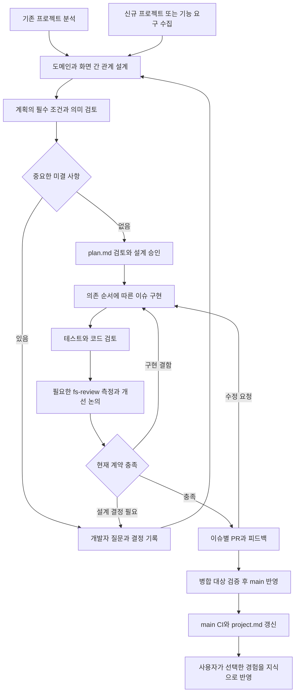
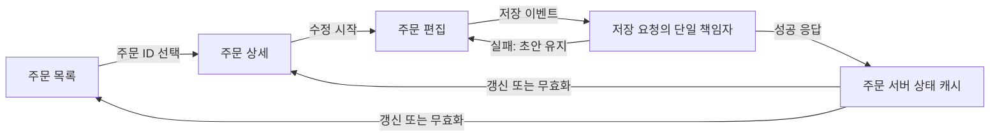

# Frontend System 방향 초안

작성일: 2026-09-29 · 수정일: 2026-09-30 · 상태: **v0.5 + 로컬 구현 반영 / project.md·요청별 plan/issue·단계별 검사 연결 / CI 문서 bot 미연결**

2026-09-30 “네 이제 구현 시작해주세요” 요청에 따라 로컬 실행 계약을 구현했다. [구현·검증 기록](../.frontend-system/evidence/fs-project-plans-2026-09-30.md)과 [배포용 실행 절차](../references/project-plans.md)에 실제 지원 범위를 기록한다.

이 문서는 사용자가 설명한 목표와 현재 FS 구현을 대조한 제품 방향 제안이다. 기존 승인 설계나 프로젝트 정책을 대체하지 않으며, 구현·의존성 설치·외부 이슈 생성·PR·병합을 실행한 기록이 아니다.

## 1. FS가 제공할 경험

**상황을 이해하고 → 놓치기 쉬운 선택을 발견하고 → 근거와 트레이드오프를 제안하고 → 개발자가 선택하고 → 계약대로 구현하고 → 실제 결과로 선택을 재평가하고 → 다음 판단에 반영한다.**

FS의 중심은 개발자의 판단을 돕는 것이다. plan·work·review·test는 이 판단 순환을 수행하는 수단이다. 개발자는 중요한 선택의 주체이며, FS는 축적한 sources·사례·skills·references의 상황 메타데이터와 현재 코드, 최상위 모델의 판단을 연결해 새로운 관점을 제시한다. 개발자가 먼저 제기한 대안이나 질문도 같은 검토 과정에 들어온다. [방향 확인 기록](../.frontend-system/decisions/fs-decision-support-loop.md)

사용자는 프로젝트당 하나의 `project.md`에서 main의 현재 구현을, 요청별 `plan.md`에서 예정된 설계와 작업 범위를 확인한다. 테스트 현황은 project.md의 도메인별 요약과 연결된 실제 검사 결과를 우선 사용한다. 별도 `test.md` 생성은 첫 구현의 필수 조건으로 두지 않는다. 모든 구현 작업은 선택한 계획의 이슈에서 출발한다. 작은 수정은 한 이슈짜리 계획으로 충분하며, 이미 합의한 요구를 기록한다는 이유로 같은 질문을 반복하지 않는다. FS 내부의 해시·정책·실행 기록은 이 문서들을 뒷받침한다.

FS의 차별점은 다음 세 가지다.

- 사용자가 축적한 출처·사례·실패 경험을 프로젝트 조건과 연결하고 아직 질문하지 않은 중요한 선택 지점을 찾아낸다.
- 기계가 확인할 규칙은 도구로 검사하고, 설계 판단은 근거·대안·반례를 갖춰 검토한다.
- 승인된 설계, 구현 이슈, 테스트, PR을 연결해 누락과 임의 변경을 드러낸다.

도구와 문서의 개수를 늘리는 것이 목표는 아니다. 적합한 코드는 유지하고, 작은 변경에는 작은 계획과 검사만 적용한다. 보장은 **명시한 계약·검사·환경·소스 범위**에 한정하며, 모든 오류의 부재나 설계의 유일한 정답을 약속하지 않는다.

### 1.1. 개발자에게 제안할 선택의 형태

필수 안전·도메인·프레임워크 조건을 만족하는 실현 가능한 선택지를 비교한다. 이미 정해진 필수 보안 조건을 생략하는 안은 대안으로 제시하지 않는다. 자동 검사와 필요한 의미 검토에서 확인하며, 검증하지 못한 조건은 완료로 처리하지 않는다.

FS는 상태를 누가 소유할지, 화면 이동 후 초안을 유지할지, 성공 응답 전에 UI를 바꿀지, 공통화할지 등 현재 작업에 영향을 주는 판단 지점을 능동적으로 찾는다. 질문 수를 늘리기 위해 대안을 만들지는 않는다. 답변은 보통 2개의 의미 있는 선택지와 추천으로 시작하고, 실제로 필요한 경우에만 추가한다. 개발자는 직접 다른 안을 제시하거나 전제를 바꿀 수 있다.

| 제안에 포함할 것 | 개발자가 알 수 있어야 하는 내용 |
| --- | --- |
| 지금 선택할 이유 | 현재 코드·흐름에서 관찰한 상황과 결정의 영향 |
| 유효한 선택지 | 각 안이 바꾸는 동작·책임, 얻는 것과 부담하는 것 |
| 추천과 전제 | 어떤 요구·조건에서 추천하는지, 무엇이 바뀌면 다른 안이 나은지 |
| 근거의 성격 | 확인한 공식 계약·프로젝트 코드·과거 사례·실험과 모델 추론을 구분 |
| 놓치기 쉬운 점 | 다른 화면, 실패·재시도·동시 변경, 유지보수·운영에 미치는 영향 |
| 검증 계획 | 선택 후 무엇을 관찰하면 기대가 맞거나 틀렸다고 판단할지 |

선택지를 소개하기 전에 실제 코드와 적용 조건을 확인한다. sources 검색은 후보를 찾는 단계이고, 선택한 참조의 조건·제외·반례와 근거를 읽는다. 상충하는 출처를 숨기지 않는다. 참고 사례가 없으면 모델의 가설과 미확인 부분을 밝힌다. 숫자로 된 확신 점수는 만들지 않는다.

예시: 즐겨찾기를 목록과 상세에서 함께 표시하는 가상 기능에서, A는 서버 성공 후 상태를 반영하고 B는 먼저 반영한 뒤 실패 시 복구한다. FS는 반응성뿐 아니라 실패 표시, 연속 클릭, 화면 이동, 공유 상태의 복구 범위를 제시한다. 개발자의 우선순위를 듣고 선택하며, 실제 응답·실패·동시 변경 시나리오와 관찰 결과로 선택을 재평가한다. 이 예시는 구현·측정한 결과가 아니다.

### 1.2. 선택 이후에도 판단이 이어진다

`상황 → 제안과 근거 → 개발자 선택과 이유 → 기대 효과·검증 기준 → 구현 → 실제 결과 → 유지/수정/판단 유보 → 조건이 있는 경험`

선택 시점의 이유와 기대는 결과를 본 뒤 고쳐 쓰지 않는다. 구현은 선택한 계약을 충실하게 따르고, review·test는 그 선택이 실패할 수 있는 조건도 확인한다. 계약대로 구현했는지와 선택의 기대 효과가 있었는지는 별도로 평가한다. 테스트 통과만으로 아키텍처가 최선이라고 결론내리지 않는다. 사용성·유지보수성처럼 즉시 수치화하기 어려운 항목은 근거 있는 정성 관찰과 미확인을 구분한다.

선택을 바꾸게 되면 무엇이 틀렸는지 구분한다: 구현 결함, 요구·환경 변화, 추천의 전제 오류, 검증 부족. 기존 결정을 보존하고 수정 이유와 새 결정으로 연결한다. AI와 개발자가 동의했다는 사실은 검증 결과가 아니다.

이를 위한 첫 평가 기준은 문서의 양보다 **중요한 선택의 누락을 줄였는지, 실현 가능한 대안을 공정하게 설명했는지, 근거 없는 추천과 불필요한 질문을 줄였는지, 후속 증거가 이전 판단을 교정했는지**다. 실제 사례와 개발자 피드백으로 확인한다.

## 2. 진입점은 두 개, 이후 흐름은 하나

| 구분 | 기존 프로젝트 리팩터링 | 신규 프로젝트·새 기능 |
| --- | --- | --- |
| 시작 자료 | 코드, 의존성, 현재 화면, 테스트, 기존 결정 | 화면안·사용자 흐름·도메인 규칙·제약·비기능 요구 |
| 첫 작업 | 현재 구조와 실제 동작, 보존할 계약, 개선할 문제 구분 | 필요한 동작과 실패 조건, 사용자·시스템 경계 정의 |
| 상태 설계 | 기존 화면·캐시·공유 상태의 관계를 먼저 추적 | 관련 화면과 데이터 생명주기를 함께 설계 |
| 테스트 출발 | 보존할 동작의 보호 테스트를 먼저 확보하고 통과 확인 | 새 계약의 실패 테스트를 먼저 만들고 구현 후 통과 |
| 결과 | 승인 설계와 전환 순서, 작은 리팩터링 이슈 | 승인 설계와 구현 순서, 작은 기능 이슈 |

기존 프로젝트에 새 기능을 추가할 때는 영향받는 기존 영역도 분석한다. 새 프로젝트라는 이유로 도메인 논의 전에 프레임워크와 도구부터 설치하지 않는다. 리팩터링에서도 기존 버그를 보존할 요구사항으로 고정하지 않는다. 동작 변경은 별도 계약으로 표시한다.

### 2.1. 명령의 책임과 script 실행 시점

아래는 **목표 실행 계약**이다. 로컬 실행기는 baseline/issue/delivery 선택과 기술→경계→행동→브라우저→빌드 순서를 지원한다. 호출 시점과 의미 해석은 호스트 스킬이 담당하며 CI의 AI 자동 호출은 아직 연결하지 않았다. 표의 script 이름은 관례의 예시이며 각 프로젝트의 실제 명령에 매핑한다. Jest/Vitest를 동시에 설치하거나 모든 프로젝트에 Storybook을 요구하지 않는다.

| 시점 | 기본 자동 처리·검사 | 조건부 검사 | AI 역할·결과 |
| --- | --- | --- | --- |
| 최초 project.md 작성 | manifest/lockfile·추적 소스 트리·기존 test/lint 설정 수집; 기존 lint·단위/통합 검사 실행 | 타입 검사·빌드, 구조 판독이 필요한 기존 경계 검사 | 도메인·이벤트·레이어·상태·패칭·스타일 해석, 사실/추론/미확인 구분 |
| fs-plan 시작 | project.md의 기준 main과 현재 작업 소스 차이, 선택한 규칙·설정의 변경 확인 | 의심되는 기존 동작을 확인할 최소 재현 | 필요한 문서 절과 sync 지식을 읽고 선택지·근거·트레이드오프 논의 |
| fs-plan 마무리 | 계획의 필수 항목·이슈 의존 순환·필수 규칙의 검사 매핑·중요 미결 항목 확인 | 실제 코드·설정 초안이 있고 권한이 있을 때 해당 검사 | 계획과 시각화 검토·승인; 전체 제품 테스트를 반복 실행하지 않음 |
| fs-work 시작 | 승인 plan/issue·선행 이슈·작업 소스 확인; 기준 lint/typecheck·관련 기존 테스트 | 패키지/경계 설정 변경 시 해당 검사·빌드 | 기존 실패 분류, 필요한 도구 설치 동의와 준비 |
| fs-work 이슈 검증 | 기술 규칙 lint/typecheck → 레이어 검사 → 단위/통합 테스트 | 해당 흐름의 Playwright; 프레임워크·번들 경계 변경 시 build; 기존 Storybook 검사 | 자동 실패 수정 후 sync 근거로 코드와 테스트를 함께 리뷰 |
| fs-work 전달 전 | 전체 승인 필수 검사·관련 브라우저 흐름·프로덕션 build | 프로젝트 정책의 추가 검사 | 현재 소스의 증거 정리, 커밋·PR 준비 |
| fs-review | 요청한 실제 화면/도메인 시나리오 실행, 현재 소스·빌드·환경 식별 | Network/HAR, 성능, heap, React 렌더, 번들, 접근성·시각 검사 중 해당 계약에 필요한 것 | 전후 수치·실패 조건·한계를 해석하고 개선 선택 제안 |
| PR CI | lockfile 설치, lint/typecheck·경계·단위/통합·필수 E2E·build | 합의한 성능/번들 예산 등 안정적으로 재현되는 검사 | 실패 원인 판단은 필요할 때만; CI 종료 코드는 코드로 판정 |
| main 변경 후 | 정확한 main 소스의 패키지·트리·테스트 목록 수집, 해당 소스의 CI lint/test 결과 연결 | 필요한 배포 후 smoke, 허용된 시각화 갱신 | 변경된 사실·관계·도메인별 테스트 요약을 project.md에 반영 |
| fs-knowledge | 원문/참조 해시·규칙 승인 연결·패키지/관련 회귀 검사 | 지침 변경 시 관련 모델 판단 eval | 원본 FS 지식 수정·조건/반례 정리, 요청된 경우 원본 저장소 PR |

필수 도구가 없으면 준비 작업으로 남기며 통과로 간주하지 않는다. 최초 분석에서는 누락을 기록하고 문서 작성을 진행할 수 있다. 구현 완료에는 해당 필수 검증을 확보해야 한다. 기존 결과는 소스·설정·환경·검사 범위가 일치할 때만 재사용한다. 동일한 집계 명령과 그 하위 명령을 중복 실행하지 않는다.

plan 단계의 '절대 규칙 함수'는 두 종류를 구분한다. 계획 ID·의존 관계·필수 검사 연결 같은 **계약 구조 검증**은 코드로 처리할 수 있다. 아직 작성하지 않은 컴포넌트의 Hooks 준수나 도메인 구현 정확성은 lint로 증명할 수 없으므로 설계 검토와 work의 실행 검사에 연결한다. Markdown을 검사했다는 이유로 제품 규칙 통과를 선언하지 않는다.

이 문서의 이슈별 eval은 결정적 계약 검사를 뜻한다. FS 자체의 `npm run test:eval`을 모든 사용자 이슈마다 실행하는 뜻이 아니다. 모델 판단 회귀 평가는 FS 지식·스킬을 바꿀 때 필요한 사례에 따로 적용한다.

### 2.2. 한 프로젝트의 공식 현재 문서: project.md

정식 문서 경로는 `.frontend-system/project.md` 하나다. 초기에는 `fs-plan`의 '프로젝트 문서 초기화' 흐름으로 제공하고 별도 공개 fs-init 명령 추가는 보류한다. 기존 init.md를 fallback으로 읽고 원문을 보존한다. project.md 재저장 시 이전 내용을 project-history에 보관한다.

project.md는 main에 구현된 사실과 채택된 규칙을 기록한다. 미병합 계획이나 작업 브랜치의 변경은 plan/evidence에 남기고 공식 현재 상태에 섞지 않는다. 신규 빈 저장소에서는 미구현 사실과 초기 제약만 기록한다.

| 문서 내용 | 작성 기준 |
| --- | --- |
| 기준 정보·요약 | 분석한 main 커밋, 분석 시점, 대상 범위, 갱신 상태, 제품 목적·주요 기술 |
| 라우터·도메인 | 경로·화면·도메인 ID, 채택한 요구/불변식, 구현과의 차이 |
| 이벤트·함수·의존 | 이벤트 ID → 진입점 → 주요 호출·상태 변화 → 실패/재시도 → 근거 코드 경로 |
| 레이어·구조 | 구현된 책임·허용 의존 방향, 폴더/주요 파일 트리, server/client 경계 |
| 상태·패칭·오류 | 원본·캐시·URL·UI 소유자, 요청 주체, 갱신/경합 처리, 오류 표시·복구 |
| 테스트 | 도메인/이벤트 ID와 테스트의 전체 제목·경로·실행 결과 연결, skip·미실행·미검증 구분 |
| 패키지·스타일 | 실제 manifest/lockfile 근거, 주요 의존성의 역할, 디자인 시스템·토큰·스타일 규칙 |
| 증거·제외 범위 | 보고서·검사 ID·코드 링크, 자동으로 해석하지 못한 관계, 알려진 문제 |

AI가 전체 문서를 매번 읽게 하지 않는다. 고정된 절과 안정적인 도메인·이벤트 ID, 짧은 표, 근거 경로를 사용하고 요청과 관련된 절부터 읽는다. 상세 테스트 결과·함수 목록·도식은 연결된 생성물/증거를 사용해 공식 진입 문서 하나를 유지한다. 테스트 제목은 가능한 러너의 목록/보고서에서 수집하며 정규식 추측을 실행 결과로 쓰지 않는다. 모든 함수의 본문을 복제하거나 주석 없는 이름만으로 도메인 의미를 확정하지 않는다.

Archify가 없으면 설치 여부를 먼저 묻고, 이미 설치·사용 선택된 경우 재사용한다. 선택하지 않아도 Markdown/Mermaid로 진행한다. 목표 시각화는 `프로젝트 → 도메인/화면 → 컴포넌트·상태 → 이벤트 시퀀스`의 계층 탐색이며, 각 노드는 관련 코드·도메인·검사 근거와 연결한다. 현 미리보기는 별도의 두 HTML일 뿐 노드 클릭으로 하위 HTML까지 이동하는 통합 탐색은 아직 구현하지 않았다. 먼저 연결된 개별 도식으로 시작해 상세 탐색 기능을 검증한다.

## 3. 규칙은 우선순위와 검사 방식을 구분한다

사용자가 제시한 최우선·우선·보통 구분을 작업 순서에 사용한다. 다만 **자동으로 검사할 수 있는가와 반드시 지켜야 하는가는 서로 다른 축**이다. 자동 검사하기 어려운 권한·데이터 손실 규칙도 필수일 수 있다.

| 순서 | 내용 | 검증 방법 | 위반 처리 |
| --- | --- | --- | --- |
| 최우선: 기술적 유효성 | 적용 버전의 문법·타입·프레임워크 필수 제약, 채택한 필수 lint | 컴파일러, 타입 검사, 공식·기존 lint, 프레임워크 빌드 | 관련 작업의 완료 차단 |
| 우선: 승인된 계약 | 도메인 불변식, 레이어 책임, 의존 방향, 상태 소유권, API·UI 계약 | 의존성 검사, unit·integration·E2E, 필요한 의미 검토 | 필수 계약 위반은 완료 차단 |
| 보통: 설계 품질 | 이름의 명확성, 책임 응집, 추상화 비용, 파일·함수 분리 | AI의 코드·호출자·반례 검토, 필요한 국소 실험 | 근거와 영향을 제시하고 수정·유지·논의 선택 |

권장 lint preset 전체를 절대 규칙으로 간주하지 않는다. `useEffect`의 필요성, SOLID 적용, 함수명 품질, 추상화 수준은 일부 자동 신호가 있더라도 대체로 맥락 판단이 필요하다. 보통 항목도 명시적으로 승인한 공개 계약이 되면 임의 변경할 수 없다.

각 규칙은 기존 policy 필드를 최대한 재사용해 다음을 연결한다.

`규칙 ID → 출처/요구사항 → 적용 조건·제외 조건 → 필수 여부 → 검사/검토 → 정상·위반 예제 → 한계`

서로 다른 규칙이 충돌하면 우선순위 숫자로 조용히 덮지 않는다. 프레임워크 제약과 요구가 양립 가능한지 조사하고, 도메인·아키텍처 선택이 필요한 지점만 개발자에게 질문한다. 자동화가 불가능한 필수 조건은 필수 검토로 남긴다.

## 4. 설계는 개별 화면보다 관계를 먼저 본다

분석 순서는 **업무 목표·불변식 → 화면 간 관계 → 상태와 이벤트 → 책임과 인터페이스 → 파일·함수·이름 → 테스트 → 이슈**로 제안한다.

전체 프로젝트 분석 요청에서는 자사 코드 영역과 제외·미검토 영역을 먼저 목록화한다. 이름만 보고 책임을 단정하지 않고 호출자, 실제 의존, 상태 변경, 실패 경로까지 추적한다. 기능 단위 요청에서는 영향을 받는 화면·호출자까지 범위를 확장하되 무관한 전체 재설계를 하지 않는다.

아래는 **설명용 가상 주문 기능**이며 실제 프로젝트의 설계나 검증 결과가 아니다.

| 설계 항목 | 기록할 내용 |
| --- | --- |
| 상태 | 원본 위치, 소유자, 읽는 화면, 바꾸는 이벤트, 수명·초기화 시점 |
| 이벤트 | 발생 주체, 선행 조건, 상태 변화, 부수 효과, 성공·실패·취소 결과 |
| 화면 간 연결 | URL·선택 ID·초안·서버 캐시의 관계, 이동·복귀·동시 편집 동작 |
| 데이터 요청 | 조회·변경 주체, 서버/클라이언트 책임, 캐시 키와 신선도, 무효화 범위 |
| 비동기 처리 | 오래된 응답, 중복 제출, 재시도, 취소와 결과 무시의 차이 |
| 낙관적 갱신 | 필요 여부, 임시 상태, 실패 복구, 경합 시 합의할 동작 |
| 사용자 피드백 | loading·empty·error·offline·pending 상태, 입력 유지, 포커스와 접근성 |

모든 항목을 의무 구현하지 않는다. 관련 없는 항목은 제외 이유를, 모르는 항목은 질문을 남긴다. 상태는 서버 상태·URL 상태·공유 편집 초안·로컬 UI 상태를 구별하며, 화면 간 관계가 있다는 이유만으로 전역 저장소에 모으지 않는다.

그다음 핵심 인터페이스와 함수의 입력·출력·책임·실패 의미를 문서화한다. TypeScript `interface`가 필요하지 않은 구조에 억지로 추가하지 않는다. 함수형 React, 기존 DI 컨테이너, Server Component 등의 실제 기술 조건을 따른다.

시각화는 책임·데이터 소유권 관계도, 이벤트별 순서도, 필요한 상태 전이도로 분리한다. 한 그림에 모든 이벤트 화살표를 겹치지 않는다. plan에서 계약·이벤트·이슈 ID를 연결하고, 원본 도식과 미리보기를 함께 보관한다. Markdown 안에서는 Mermaid를 우선 검토하고, 확대·탐색이 필요한 경우 설치된 Archify의 독립 HTML을 활용할 수 있다. 원본은 선택한 도구의 텍스트 명세 하나로 유지하고 HTML을 별도 설계 원본으로 편집하지 않는다. 편집형 제품이 실제로 필요해질 때 React Flow 같은 라이브러리를 검토한다. 이 도구들을 소비 프로젝트의 런타임 의존성으로 설치하지 않는다.

화살표는 설계한 인과 관계를 뜻한다. React의 실제 commit 순서나 네트워크 측정이라고 표현하지 않는다. 실행 검증은 Profiler·브라우저 테스트·네트워크 기록 등과 별도로 연결한다. [가격 화면 계획 예시](previews/price-screen.plan.md)에 첨부 이미지 기반의 미승인 설계와 두 미리보기를 제시한다.

### 4.1. 디자인 이미지에서 구현 계약까지

이미지는 시각적 근거이며 동작 명세 전체가 아니다. 관찰된 UI, 개발자가 명시한 요구, AI의 추론, 미결 질문을 구분한다. 추론한 drag and drop·낙관적 업데이트·백그라운드 갱신을 요구사항으로 확정하지 않는다.

1. 화면과 화면 간 이동, 사용자 목표, 데이터 표시와 조작을 읽고 기존 코드·API·설치 버전·상태 도구를 확인한다.
2. 도메인 불변식과 성공·실패·취소·경합 사례를 정한다. 비기능 요구는 관련 흐름에 연결한다. 예를 들어 drag and drop에는 키보드 대체 조작·포커스·실패 복구, 백그라운드 갱신에는 편집 중 데이터 충돌과 사용자 표시를 논의한다.
3. URL·서버 캐시·공유 초안·로컬 UI·파생 값의 소유권과 수명을 정한다. 외부 store가 설치되어 있어도 모든 상태를 넣지 않는다. 여러 화면의 공유·유지 요구가 있는 상태에 적용 여부를 비교한다.
4. Next.js라면 초기 데이터·인증·비밀 정보·서버 조합과 브라우저 이벤트·상태·API의 경계를 정한다. Client 경계의 import와 서버에서 전달하는 children/props의 구성을 구분한다. 인증은 서버 책임에 남기며, 모든 자식을 Client로 만들거나 모든 조회를 한쪽에 모으는 규칙을 만들지 않는다.
5. 현 아키텍처에 맞는 폴더·파일·주요 함수명, 입력·출력·책임·실패 의미를 정한다. 계획에 필요한 공개 계약을 명확히 하되 사소한 구현까지 가짜 정밀도로 고정하지 않는다.
6. 필수 규칙을 먼저 확인해 불가능한 대안을 제외하고, 남은 중요한 선택에 근거·트레이드오프·검증 기준을 붙여 개발자와 논의한다. 실행 가능한 기존 검사는 수행하고, 코드·검사 환경이 없는 항목은 검증 예정으로 남긴다.
7. 결정된 관계도·이벤트·인터페이스·테스트를 이슈에 연결해 최종 계획을 제시한다.

토큰 절감은 전체 자료를 매번 읽지 않고 현재 기술·문제에 맞는 근거를 선택하고, 자동 검사의 요약에서 실패한 항목만 확장하며, 변경된 설계와 영향받는 호출자만 다시 분석하는 방식으로 추구한다. 생략한 필수 검토를 절감으로 계산하지 않는다. 실제 토큰·시간·재작업을 측정하기 전에는 절감 효과를 수치로 주장하지 않는다.

## 5. 반복 분석의 목적과 종료 조건

반복은 신뢰도를 높이는 자동 투표가 아니라 **확인한 결함을 줄이고 계약의 누락을 찾는 과정**이다.

1. 기술·도메인·아키텍처 제약을 확인하고 판정 가능한 항목을 검사에 연결한다.
2. 상태·이벤트·실패 시나리오와 책임·이름·추상화의 적합성을 검토한다.
3. 잘못된 입력·응답 역전·부분 실패 등 반례를 대입하고 테스트가 이를 구별하는지 확인한다.
4. 수정 또는 개발자 답변으로 달라진 부분과 영향받는 관계만 다시 검토한다.

기존 코드가 없는 설계 단계에서는 실행하지 않은 검사를 `예정`으로 표시한다. 테스트와 checker를 만들었다면 정상 사례 통과와 의도한 위반 사례 실패를 확인한다. 분석 문서만 보고 컴파일·런타임 검증을 통과했다고 쓰지 않는다.

**설계 승인 준비 조건:** 중요한 도메인·경계 결정이 해결되고, 각 필수 계약에 검사 또는 검토 방법이 있으며, 이슈 담당자가 제품 동작을 새로 결정하지 않고 착수할 수 있다. 외부 환경 문제는 명시적으로 남긴다.

초안에서는 기존의 작업 단계당 전체 시도 최대 3회를 유지한다. 이는 모든 설계를 3번 반복하거나 신뢰도 확률을 산출한다는 뜻이 아니다. 추가 증거 없이 같은 의견만 반복되면 불확실성을 기록하고 질문한다. 답변이 필요한 단계만 대기하고 독립 작업은 진행할 수 있다.

## 6. plan.md와 이슈 계약

`plan.md`는 `fs-plan`의 핵심 결과물이며 `fs-work`가 실행할 **해당 요청의 설계·작업 계약**이다. 전체 리팩터링, 특정 기능, 여러 화면의 로직 설계, 신규 프로젝트 모두 같은 진입점을 사용하되 범위에 맞게 문서 크기를 조절한다.

요청별 보관 경로는 `.frontend-system/plans/<plan-id>/plan.md`다. 파일명이 반복되어도 plan ID로 구분하며, 진행 중인 같은 요청의 피드백은 새 계획을 남발하지 않고 해당 계획의 버전을 갱신한다. 서로 다른 요청은 별도 계획으로 보관한다. 계획 경로와 planId 선택은 로컬 런타임에 연결했다.

work는 **plan ID + 승인한 버전 + issue ID**를 기준으로 착수하고, 선행 이슈·공통 프로젝트 정책·현재 소스와의 차이를 확인한다. 대상이 명확하면 자동으로 선택하고 여러 후보가 있으면 선택을 요청한다. 독립 계획 간 충돌이나 공통 정책 변경이 생기면 영향받는 계획을 재검토한다. 계획 없이 구현하지 않되 분석만·리뷰만·검증만 요청에 구현 이슈를 억지로 만들지는 않는다.

초기 구현은 기존 `revision.md`·policy·execution 검증을 재사용한다. plan의 계약과 승인 스냅샷을 연결하되 두 문서를 독립적인 설계 원본으로 편집하지 않는다. **현재 런타임은 planId별 설계·승인·이슈·실행·검사·시도·리뷰를 분리한다. 기존 루트 revision/execution은 planId를 생략하면 계속 읽는다.** 호스트는 한 번에 한 계획을 선택해 실행하고, 다중 계획 동시 실행은 실제 필요가 있을 때 보강한다.

피드백은 `fs-plan`에서 반영해 설계와 정책을 함께 갱신한다. 직접 수정된 plan은 기존 승인으로 실행하지 않고 변경 의도를 반영·재검토한다. 승인 해시는 plan ID·버전·본문·policy·issues를 묶는다. plan.md의 이슈 계약 절은 도구가 생성하며, 실행 상태는 progress.md로 분리했다. 수동 plan 수정은 승인을 무효화한다. 별도 시각 편집기는 구현하지 않았다.

plan에 포함할 내용은 다음으로 제한한다.

1. 목표, 범위·제외 범위, 현재 문제와 근거, 보존·변경할 동작.
2. 도메인 계약, 화면 간 상태·이벤트 관계와 핵심 실패 시나리오.
3. 선택한 아키텍처, 레이어 책임·의존 방향, 적용 라이브러리와 조건.
4. 핵심 폴더·파일·공개 인터페이스·함수 책임과 이름, 선택 이유와 대안.
5. 규칙별 검사·테스트·리뷰 매핑, 환경 준비와 미검증 항목.
6. 의존 순서가 있는 이슈 목록, 질문·결정 기록, 승인 버전.

이슈는 **독립적으로 검증·리뷰할 수 있는 가장 작은 일관된 변경**으로 나눈다. 함수 하나마다 이슈를 만들지 않는다. 호출자와 계약을 함께 바꿔야 하는 변경은 한 단위로 묶거나 호환 가능한 전환 단계를 둔다.

| 이슈 필드 | 정의 |
| --- | --- |
| ID·목표·선행 이슈 | 무엇을 완료하는지, 무엇이 먼저 필요한지 |
| 근거·계약 ID | 도메인 요구, 설계 결정, 필수 규칙과 연결 |
| 변경 범위·금지 범위 | 파일·레이어·호출자, 이번에 바꾸지 않을 동작 |
| 구현 계약 | 핵심 함수·타입·이벤트, 입력·출력·책임, 상태 소유권 |
| 테스트 계획 | 보존/신규/변경 동작, 정상·실패·경계 사례, 실행 명령 |
| 완료 조건 | 필수 검사, 의미 검토, 필요한 화면·성능 증거, 미결 사항 |
| 전달 정보 | 허용한 구현 재량, 남은 질문, PR 범위와 되돌리기 고려 |

예: `ORDER-02 오래된 상세 응답 반영 방지`는 상세 조회의 식별 계약과 상태 갱신 책임을 고정하고, “A 조회 → B로 이동 → B 성공 → A 지연 성공/실패”를 검사한다. 적용 라이브러리의 실제 취소·캐시 동작을 확인한 뒤 구현을 결정하며, 무조건 AbortController나 전역 큐를 추가하지 않는다.

## 7. fs-work은 승인한 이슈에 충실하게 구현한다

| 그대로 구현할 것 | 재량을 허용할 것 | 다시 질문할 것 |
| --- | --- | --- |
| 도메인 계약, 상태 소유권, 의존 방향, 지정된 공개 인터페이스, 수용 기준 | 동작·공개 계약을 바꾸지 않는 지역 변수, 국소 보조 함수, 기존 도구 활용 | 제품 동작·의존성 전략·보안 경계·캐시 의미·테스트 기대값 변경, 계획의 모순 |

위 재량 범위는 **2026-09-29 사용자와 합의했다.** fs-work은 실제 구현 단계이며 승인된 계약을 최대한 충실히 이행한다. 사용자가 특정 파일·함수명을 계약으로 고정했다면 따른다. 계약을 바꾸지 않는 내부 구현은 매번 묻지 않고 진행한다. 잘못되거나 구현 불가능한 계획을 발견하면 임의로 계약을 변경하지 않고 문제와 대안을 제시해 관련 결정으로 되돌아간다. [합의 기록](../.frontend-system/decisions/fs-work-contract-boundary.md)

work 중에도 새로운 중요한 선택이 발견될 수 있다. 이때 상황·선택지·추천 근거를 개발자에게 제시하고, 결정된 계약에 맞춰 구현을 계속한다. 이미 승인한 선택을 새로운 근거 없이 반복해서 묻지 않는다. 개발자가 먼저 제안한 선택도 같은 방식으로 검토한다.

작업 순서는 다음과 같다.

`plan·이슈·승인 상태 확인 → 환경·기준 검사 → 구현과 계약 테스트 작성 → 기술/레이어/동작 검사 → sync 기반 의미 리뷰 → 수정·재검증 → 증거 갱신 → 필요한 측정 리뷰 → 커밋·PR 준비`

리팩터링은 보호 테스트가 기존의 합의된 동작에서 통과한 뒤 구조를 바꾼다. 신규 기능은 의도한 이유로 실패하는 테스트에서 시작해 구현으로 통과시킨다. 기존 버그 수정은 재현 실패 → 수정 → 통과를 기록한다. 테스트하기 어려운 결합은 최소 분리의 필요성과 보호할 외부 동작을 먼저 합의한다.

성공을 위해 기대값을 낮추거나 테스트를 삭제·skip하거나 스냅샷을 자동 승인하지 않는다. 검사 자산의 정당한 변경은 영향과 정책을 검토한다. 후속 편집이 증거를 무효화하면 필요한 검사·리뷰를 다시 실행한다.

## 8. 테스트는 work에 포함하고 실제 결과를 기록한다

핵심 사용자 명령은 당분간 `fs-plan`, `fs-work`, `fs-review`, `fs-knowledge` 네 개를 유지하는 안을 권한다.

| 사용자 요청 | 제안하는 처리 |
| --- | --- |
| 기존 프로젝트 리팩터링 설계 | `fs-plan`에서 분석·논의·plan 작성 |
| 신규 프로젝트·기능 설계 | `fs-plan`에서 요구 수집·관계·계약 설계 |
| 특정 이슈 구현·리팩터링 | `fs-work ISSUE-ID` |
| 검증만 | `fs-work … 검증만` — 수정 없이 기존 검사 실행 |
| 테스트 보강 | `fs-work … 테스트를 추가하고 검증` — 승인 범위에서 작성 |
| 코드·설계 검토 또는 실행 측정 | `fs-review`; 검토만/측정/개선까지의 요청 범위 구분 |
| 판단 경험을 공용 지식으로 반영 | `fs-knowledge` 등록 후 범위를 정해 sync |

현재 `fs:refact`, `fs:test`는 실제 공개 명령이 아니다. 별칭을 도입한다면 위 절차로 연결하고 별도의 중복 실행기를 만들지 않는다. 특히 `검증만`과 `테스트 작성까지`의 쓰기 권한을 구분한다. comprehensive test는 별도 도구 종류로 만들지 않고 통합·회귀·E2E의 어느 계약을 의미하는지 정한다.

첫 구현은 실제 러너의 발견 목록·보고서를 증거로 연결하고 project.md에 도메인별 요약을 반영한다. 별도 `test.md`가 필요해지면 **선택한 테스트 러너의 발견 목록과 실행 보고서에서 생성하는 검증 현황**으로 추가한다. AI가 제목을 추측하거나 소스 문자열을 정규식으로 긁어 실행 결과로 삼지 않는다. 처음에는 실제 대표 프로젝트의 러너만 지원한다.

| 표시 정보 | 목적 |
| --- | --- |
| 이슈·계약 ID, 파일, suite/describe 및 case/it 전체 이름 | 어떤 요구를 검증하는지 추적 |
| 종류·환경·데이터 조건 | unit / integration / E2E / UI·접근성의 범위 구분 |
| 예정·통과·실패·skip·미실행·오래됨 | 테스트 존재와 현재 실행 성공 구분 |
| 실행 시점, 소스·설정 식별, 명령, check ID | 현재 코드의 결과인지 확인 |
| 로그·trace·화면·리포트 링크 | 실패 분석과 검증 근거 연결 |

예정 사례는 plan에서, 발견·실행 사례는 러너에서 가져와 구분한다. 동적·파라미터화 테스트, 중복 제목, 재시도, 부분 실행을 보존한다. 성공한 재시도 앞의 실패도 숨기지 않는다. 선택 실행하지 않은 테스트를 통과로 표시하지 않는다. 지원하지 않는 러너는 원본 보고서 링크와 미지원 범위를 표시한다.

## 9. 검증 라이브러리와 진단 도구의 역할

FS 자체는 기존 도구를 실행하고 계약·판정·증거를 연결한다. 기존 도구가 충분하면 재사용하고, 부족한 환경은 계획에 반영해 승인된 work 범위에서 대상 프로젝트에 설치한다. 설치 완료와 실행 준비 완료는 구분한다.

**합의한 설치·실행 방향:** FS는 지식과 실행 절차를 배포하고, 대상 프로젝트 또는 워크스페이스는 검사 도구의 개발 의존성·lockfile·설정·테스트·스크립트를 관리한다. 브라우저와 OS 의존성은 실행 환경에 준비한다. 운영 계측은 실제 앱과 운영 환경에 연결한다. CI는 같은 프로젝트 스크립트를 실행하고 필요한 결과물을 보존하며, 필수 검사 설정과 배포 권한은 구분한다.

이를 [배포용 검증 도구 절차](../references/verification-tools.md)와 plan/work 스킬에 반영한다. 현재 예제에는 기존 Playwright의 HTML·JSON 보고서와 실패 trace를 CI artifact로 보존하는 설정을 연결한다. 전체 초안 승인, 소비 프로젝트의 설치 완료, 원격 CI 실행 성공, test.md 자동 생성까지 의미하지는 않는다.

| 목적 | 후보 | FS에 연결할 내용 |
| --- | --- | --- |
| 문법·프레임워크 | TypeScript, ESLint, 프레임워크 빌드 | 실제 버전의 적용 규칙, 통과·위반 진단 |
| 의존 방향 | dependency-cruiser 또는 기존 경계 검사 | 합의한 규칙과 분석 범위, 위반·해석 불가 의존 |
| 사용자 흐름 | 기존 unit/integration 러너, Playwright | assertion과 필요 시 trace, 실패·재시도 동작 |
| 접근성 | axe + Playwright, 기존 접근성 검사 | 방문한 화면 상태의 자동 탐지 결과, 수동 확인 범위 |
| 시각 회귀 | 기존 Storybook, Playwright 비교, 필요 시 Chromatic | 합의한 기준 화면과 차이, 의도한 변경의 검토 |
| 렌더·서버 상태 | React DevTools·Profiler, Query Devtools | 관찰한 상태·렌더링과 재현 절차; 자체로 통과 판정하지 않음 |
| 통신·성능·메모리 | Chrome Network·Performance·Memory | 요청·trace·heap 자료, 측정 조건과 해석 |
| 번들·운영 | 빌드에 맞는 Analyzer, 필요 시 OpenTelemetry | 번들 기준 또는 계측 범위·운영 관찰 기간 |

그래프·trace·snapshot이 생성됐다고 계약이 통과한 것은 아니다. 기준이 없는 측정은 `자료 수집 완료 / 판정 미완료`로 남긴다. DevTools 조작 권한과 실행 환경, 외부 서비스 연결·비용·업로드 범위를 확인한다. 민감한 요청·응답을 포함한 자료를 무조건 Git에 넣지 않는다.

1차 구현은 기존 script 실행과 로컬 증거 파일 연결을 재사용한다. 모든 브라우저·도구를 위한 공통 플랫폼, 대시보드, 자동 계측 서버는 실제 필요가 확인될 때 확장한다. 접근성·보안·실패 처리는 선택 도구 유무와 관계없이 요구 범위에서 검토한다.

도구 검토 근거: [dependency-cruiser](https://github.com/sverweij/dependency-cruiser), [Playwright assertion](https://playwright.dev/docs/test-assertions), [trace](https://playwright.dev/docs/trace-viewer), [axe 연계와 수동 검토 한계](https://playwright.dev/docs/accessibility-testing), [React Profiler](https://react.dev/reference/react/Profiler), [Chromatic](https://www.chromatic.com/docs/visual/), [OpenTelemetry JS](https://opentelemetry.io/docs/languages/js/). 2026-09-28 공식 문서 검토를 바탕으로 한 후보이며 대상 프로젝트 설치 버전은 별도 확인한다.

### 9.1. fs-review는 실행 결과와 수치를 판단한다

work의 필수 검사는 구현 계약 준수에 집중하고, review는 실제 화면에서 선택의 효과와 놓친 실패 조건을 측정한다. 모든 이슈에 모든 무거운 측정을 실행하지 않는다. plan에 이미 필수인 접근성·성능 예산·브라우저 계약을 선택적 review로 미루지도 않는다.

측정 전에 대상 소스/빌드, 시나리오, 데이터, 기기·브라우저, 네트워크/CPU 조건, cold/warm cache, 반복 횟수, 합의한 통과 기준을 고정한다. 전후는 같은 조건으로 비교하고 원본 결과와 변동을 남긴다. 성능 수치가 좋아져도 도메인·접근성 회귀가 생기면 개선으로 승인하지 않는다. 로컬 측정과 운영 사용자 지표를 구분하고, 단일 heap 증가나 render 횟수만으로 누수·성능 결함을 단정하지 않는다.

브라우저 도구 후보는 [Chrome DevTools MCP](https://github.com/ChromeDevTools/chrome-devtools-mcp)다. 2026-09-30 확인한 [공식 도구 목록](https://github.com/ChromeDevTools/chrome-devtools-mcp/blob/main/docs/tool-reference.md)에는 Network 요청, Performance trace, heap snapshot/비교 등이 있다. [WebMCP](https://developer.chrome.com/blog/webmcp-epp)는 사이트가 에이전트에 구조화된 동작을 노출하는 별도 개념이다. MCP 연결 전에 사용자 동의를 받고 실제 노출 도구·버전·데이터 전송 설정을 확인한다. HAR 내보내기·React Profiler·번들 분석·운영 Web Vitals는 각각 사용 가능한 별도 수집 경로를 확인하며 하나의 MCP 연결로 모두 해결됐다고 하지 않는다.

dependency-cruiser도 새 설치 전 사용자에게 묻는다. 기존 경계 검사가 계약을 충분히 검사하면 재사용한다. Archify·브라우저 MCP는 에이전트 실행 환경에, 프로젝트 검사기는 해당 프로젝트/워크스페이스에 둔다. 이번 문서는 실제 설치나 외부 계정 연결을 수행한 기록이 아니다.

review 결과는 `관찰·수치 → 원인/가설 → 개선 대안·비용 → 사용자 선택 → 기존 plan 수정 또는 작은 개선 plan → fs-work → 동일 조건 재측정`으로 이어진다. '검토만' 요청에서는 제품 코드·테스트·설정을 바꾸지 않는다. 사용자가 개선까지 요청하면 그 범위에서 plan/work로 이어가고 이미 승인한 선택은 다시 묻지 않는다. fs-review 스킬에 측정 조건·원본 증거·동일 조건 재측정과 승인된 개선의 plan/work 라우팅을 반영했다. 새 브라우저 도구는 설치하지 않았다.

## 10. 이슈별 PR과 main 반영

로컬 이슈 명세부터 사용하고 GitHub 등 원격 이슈 생성 여부는 프로젝트 설정에서 선택한다. 설계 문서를 만들었다는 이유로 외부 이슈를 자동 생성하지 않는다.

권장 흐름은 `선행 이슈 병합 → 최신 기준 브랜치에서 이슈 작업 → 검사·검토 → 이슈별 PR → 피드백 수정 → 최신 PR 소스 재검증 → 병합`이다. 병렬 작업이나 stacked PR은 실제 이점이 있을 때만 추가한다.

PR에는 계약·이슈 ID, 변경 동작, 검증 결과, test.md 또는 증거 링크, 미검증 사항을 포함한다. 코드 수정·리뷰 의견·기준 브랜치 변경이 있었으면 영향에 맞게 검사를 다시 수행한다. PR 생성, 승인, merge 가능 여부는 구분하며 로컬 verified만으로 main 반영을 완료했다고 쓰지 않는다.

사용자가 프로젝트별 PR 생성·푸시 권한을 미리 정하면 그 범위에서 실행한다. 병합은 합의한 승인 방식과 원격 필수 검사에 따른다. 이 문서 자체는 그 운영 권한을 승인하지 않는다. GitHub 장애나 CI 실패·권한 부족은 코드 완료와 별도로 기록한다.

### 10.1. main 반영 후 project.md를 갱신한다

목표 흐름은 `main 변경 감지 → 정확한 커밋 checkout → CI 결과·패키지·트리·테스트 목록 수집 → AI 변경 분석 → project.md/선택한 도식 갱신 → 문서 검증·반영`이다. PR의 CI를 얻으려면 보통 commit/push/PR 생성이 먼저이므로 'CI 통과 후에만 PR 생성'을 고정 순서로 강제하지 않는다. 필수 검사와 필요한 review를 통과한 변경만 병합하며, 병합된 main 소스의 검사와 배포 상태는 따로 기록한다.

main 갱신은 CI/CD 마지막의 별도 문서 작업으로 연결한다. 같은 main 소스·설정·환경·검사 범위의 CI 결과가 있으면 다시 테스트하지 않고 재사용한다. 실패한 CI도 실제 main 상태의 일부다. 문서에 실패/미확인을 기록할 수 있으나 verified로 바꾸지 않는다. CD가 없는 프로젝트에서는 CI 이후에 실행한다.

지속 실행하려면 승인된 AI 실행 환경·자격 증명·비용 범위·저장소 쓰기 권한이 필요하다. 일반 스크립트가 도메인 의미까지 작성한다고 가정하지 않는다. 초기에는 같은 절차를 병합 후 호스트가 실행할 수 있게 하고, CI 자동 호출은 실행 환경이 정해진 뒤 연결한다.

**최신성 계약:** main만 공식 기준으로 삼되 갱신 작업은 비동기이므로 항상 즉시 최신이라고 표시할 수 없다. 문서의 분석 기준 커밋과 현재 main을 비교해 `current / pending / stale / failed`를 계산하는 방식을 제안한다. 생성 중 main이 바뀌면 이전 결과를 최신으로 덮어쓰지 않고 변경분을 반영해 다시 생성한다. 작업 중단 시 마지막 성공 문서를 유지하고 새 main의 미반영 상태를 드러낸다.

문서 전용 변경이 다시 문서 생성을 촉발하는 무한 루프를 막는다. 분석 대상에는 제품 코드·테스트·설정·manifest/lockfile을 포함하고 문서 생성물만 바뀐 경우에는 제품 사실 재분석을 생략한다. 초기 반영 방식은 문서 갱신 PR을 권하며, 프로젝트가 승인한 bot 쓰기 정책이 있다면 그 정책을 따른다. 문서 PR 방식에는 갱신 대기 시간이 있음을 명시한다. 공식 문서의 기준 커밋은 계속 보존하고 최신 여부는 제품 분석 대상의 차이까지 비교한다.

## 11. 개발자 질문과 답변을 판단 자산으로 축적한다

사용자가 말한 reversion은 역할에 따라 **설계 변경 이력(revision)**과 **판단 기록(decision)**으로 구분하고, 새로운 중복 저장 체계는 만들지 않는 안을 권한다.

중요한 모호함이나 아직 고려하지 않은 선택 지점이 있으면 근거 있는 대안과 함께 질문을 하나씩 제시한다. 저장소에서 확인할 수 있는 버전·파일 위치는 직접 조사한다. 질문 기록에는 다음 내용을 필요한 만큼 남긴다.

| 항목 | 내용 |
| --- | --- |
| 상황·증상 | 어떤 도메인·화면·상태·이벤트에서 판단이 필요했는가 |
| 근거·질문 | 코드·출처·실행 결과, 확인되지 않은 부분 |
| 대안·결정 | 선택지의 비용, 개발자의 답, 선택 이유와 유지할 계약 |
| 추천·기대 | FS의 추천과 전제, 선택 당시 기대 효과·검증 기준, 개발자가 우선한 가치 |
| 적용 범위·반례 | 기술·버전·라이브러리·환경, 적용하지 않을 조건 |
| 전후 결과 | 변경 내용, 실제 비교 방법·결과, 미측정 항목 |
| 추적 정보 | 연결된 설계 버전·이슈·검사·PR, 대체한 결정, 재검토 조건 |
| 검색 메타데이터 | 관찰 증상·별칭, 도메인, 조건, 사례 유형, 검증 수준 |

프로젝트 판단은 먼저 `.frontend-system/decisions/`와 기존 evidence에 저장한다. 사용자가 공용 반영을 지시하면 민감 정보를 제거하고 `fs-knowledge`로 등록한다. sync에서 개념·조건부 판단·규칙 후보를 나누고, 새 의무는 정확한 후보의 승인을 받는다. 배포 후 플러그인을 업데이트하더라도 기존 프로젝트의 pinned policy는 별도 검토 없이 바뀌지 않는다.

fs-knowledge는 실행 위치와 무관하게 원본 FS 저장소를 갱신한다. 소비 프로젝트에서 호출하면 원본 checkout과 remote를 확인하고, 그 저장소의 별도 브랜치/필요한 worktree에서 자료·피드백을 수정한다. 소비 프로젝트의 작업 브랜치나 설치된 plugin cache를 대신 수정하지 않는다. 사용자 요청 또는 미리 합의한 기여 권한 범위에서 검사 후 원본 FS로 PR을 만들며 원본 main에 자동 병합하지 않는다. 이번 방향 제안은 현재 변경을 곧바로 push/PR하라는 실행 요청이 아니다.

개선 평가는 동일 조건의 전후 사례로 수행한다. 결함 탐지, 잘못된 제안, 불필요한 수정, 사용자 재작업, 실행 시간·비용을 가능한 범위에서 기록한다. 측정하지 못한 항목은 미측정으로 남기고, 학습에 쓴 사례 외의 사례에서도 오적용을 확인한다. 사용자 취향은 보편적 기술 규칙으로 승격하지 않는다.

## 12. 현재 구현과 차이

2026-09-30 저장소 코드·스킬·문서를 확인했다. 아래의 '있음'은 구현 또는 절차의 존재를 뜻하며 이번에 실행 검증을 다시 했다는 뜻은 아니다.

| 기능 | 현재 상태 | 필요한 보강 |
| --- | --- | --- |
| 네 가지 사용자 명령 | 있음 | init은 우선 plan 내 초기 문서 작성 흐름으로 통합 |
| 공식 project.md | 현재 init.md 우선, project.md는 legacy fallback | 내용 보존 이관·main 기준 식별·변경 후 AI 갱신 |
| 단계별 검사 호출 | 스킬 절차와 고정 정렬 실행기 있음 | 표 2.1의 시점·순서·필수 조건을 실행기에 연결 |
| 기존·신규 분석과 도메인 논의 | 스킬 절차 있음 | 두 진입점과 작은 작업의 범위를 사용자에게 명확히 표시 |
| 승인된 설계와 정책, 변경 후 재검증 | 도구 구현 있음 | plan.md 통합 뷰와 변경 감지 연결 |
| 요청별 계획과 계획 기반 실행 | 제품 방향과 문서 예시 반영 | plan ID·승인 버전·issue ID를 현재 단일 revision/execution과 연결 |
| 화면 간 상태·이벤트 관계 | 설계 절차에 항목 있음 | 관계도·소유권·실패 전이와 이슈 매핑 형식 정착 |
| 규칙 분류와 검사 연결 | layer/required/recommended/verification 있음 | 우선순위 의미 정리; 판단을 자동 검사로 과장하지 않기 |
| 의존 순서와 최대 3회 시도 | 실행 단계 구현 있음 | 최소 이슈 계약의 내용·질문·승인 버전과 연결 |
| 테스트 선작성·전환 보호 | 절차와 예제 있음 | 이슈별 계약-사례 누락 확인과 실행 보고 |
| 도구 실행 | package script 발견·실행·로그 저장 있음 | 준비 상태와 도구별 결과물·환경·범위 연결 |
| 구조·프레임워크·도메인 검증 | Next/React fixture의 경계·lint·build·주문 검사 있음 | 실제 소비 프로젝트에서 검증; fixture 성공을 일반 성과로 쓰지 않기 |
| 테스트 현황 | 예제 JSON/HTML 보고서 있음 | 도메인별 목록과 project.md 요약 연결; test.md는 후순위 |
| fs-review 측정 | 현재 읽기 전용 리뷰와 기존 검사 실행 | 브라우저 연결·조건 고정·전후 수치·개선 plan/work 연결 |
| main 이후 문서 갱신 | 자동 실행 없음 | AI 실행 환경·CI/쓰기 정책·최신성 판정·루프 방지 |
| Archify 계층 탐색 | 개별 도식 HTML 예시 있음 | 노드에서 하위 도메인/시퀀스로 연결하는 탐색 검증 |
| 소비 프로젝트의 지식 기여 | 원본 저장소 작업 지침 있음 | 별도 브랜치·검사·원본 PR 처리 정착 |
| 이슈별 PR·병합 | 전용 실행 흐름 없음 | 프로젝트별 권한·브랜치·CI·최신 소스와 연결 |
| 질문·결정·근거 기록 | decisions/evidence/revision 기반 있음 | 공통 기록 형태와 피드백 사례 검색·회귀 평가 |
| 능동적인 선택 제안 | 대안·질문·트레이드오프를 다루는 지침 있음 | 중요한 선택 발견, 선택지 비교, 사전 기대와 실제 결과의 연결을 실제 사례로 평가 |
| 자료 등록·sync·규칙 승인 | 구현 있음 | 실제 오판·수정 사례로 판단 품질 평가 확대 |

확인한 코드의 근거: [plan 스킬](../skills/fs-plan/SKILL.md), [work 스킬](../skills/fs-work/SKILL.md), [설계·판단 절차](../references/decision-workflow.md), [검증 정책](../references/workflow-policy.md), [policy 스키마](../src/application/policy.ts), [실행·승인·시도 기록](../src/application/workflow-store.ts), [검사 실행](../src/application/run-capabilities.ts), [스크립트 발견](../src/adapters/filesystem/project-discovery.ts), [테스트 전환 절차](../references/testing-and-transition.md), [기존 eval](../test/evals/README.md), [fixture 검증](../test/fixtures/frontend/scripts/acceptance.mjs), [CI](../.github/workflows/ci.yml).

`get_work_context(mode: prepare)`도 읽었다. 이 FS 저장소의 기존 workflow는 승인 정책이 있지만 현재 verification은 `stale`이다. 이 초안 작성으로 과거 구현 검증을 갱신하거나 완료 상태로 바꾸지 않았다.

## 13. 작게 도입할 순서와 논의할 사항

| 단계 | 결과물 | 확인할 기준 |
| --- | --- | --- |
| 1. 단계별 검사 계약 | 2.1 표를 대표 프로젝트의 실제 script에 매핑 | plan에서 불필요한 전체 검사를 반복하지 않고 work 필수 검사는 누락하지 않음 |
| 2. 문서와 실행 연결 | main 기준 project.md, 요청별 plan/issue, 기존 승인·검사 실행기 연결 | 오래된 context·미승인 계획·과거 검증으로 구현 완료하지 않음 |
| 3. 측정과 전달 | 한 화면의 review 측정·개선·PR·main·문서 갱신 | 전후 조건과 소스가 같고 병합/문서 최신성을 구분함 |
| 4. 선택 기능 확대 | CI의 AI 갱신, Archify 하위 탐색, 원본 FS 지식 기여 PR | 실제 사용 근거로 필요한 기능만 확장하고 루프·잘못된 원본 수정 방지 |

각 단계는 대표 사례 하나로 시작한다. 신규 기능과 기존 프로젝트 리팩터링을 최소 한 사례씩 확인한 뒤 적용 범위를 넓힌다. 모든 도구를 설치하거나 새로운 에이전트 플랫폼을 먼저 만들지 않는다.

**합의 완료: work의 구현 재량 범위.** 도메인·상태 소유권·의존 방향·핵심 인터페이스를 고정하고, 내부 지역 변수·보조 함수는 계약을 유지하는 범위에서 재량을 준다. 사용자가 지정한 구체적 이름은 계약으로 취급한다. 이는 work의 역할에 대한 합의이며 전체 초안이나 개별 구현 계획의 승인을 뜻하지 않는다.

**방향 확인: 판단 지원이 중심.** 개발자에게 상황에 맞는 선택지·추천·근거를 제시하고 실제 결과로 재평가한다. 2026-09-30 제안에 따라 먼저 단계별 script 실행 시점을 정하고, project.md/plan/work/review/knowledge의 책임을 연결한다. 정확한 저장 경로·문서 bot 권한·AI 실행 환경처럼 아직 선택되지 않은 항목은 승인된 결정으로 기록하지 않는다.
