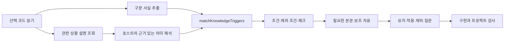
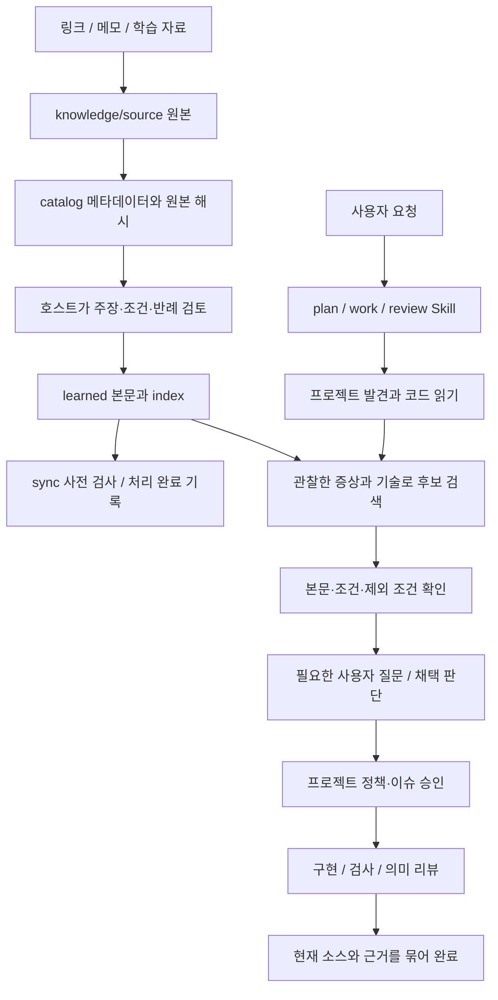

# FS 코드와 사용 흐름

이 문서는 2026-10-02 작업 트리의 구현을 설명한다. 이전 모델 실험의 FS 스냅샷과는 다르다. 처음에는 아래 흐름을 읽고, 관심 단계의 소스 링크로 들어가면 된다.

## 코드 트리거와 판단

`inspect_code_knowledge({files: ["src/Search.tsx"], technologies: ["React"]})`는
선택 파일에서 import의 실제 로컬 바인딩과 호출을 조사한다. `useEffect as effect`
별칭도 `react#useEffect`로 연결하며, 같은 이름의 지역 변수는 구분한다.
호스트는 먼저 코드를 읽고 `discover_knowledge_triggers`에서 증상·기술·영역으로
상황 설명을 조회한다. 필요한 상황만 실제 근거 코드와 함께 interpretations에
추가한다. 전체 어휘 대신 최대 20개씩 조회한다. 도구는 도메인이나 상태의 의미를 대신 해석하지 않는다.

인덱스의 triggers는 작은 체크리스트로 이어진다. 체크리스트는 참조·check·파일·행별
itemId를 가지며 각 호출 위치를 구분한다. 상세 예시는 기존 참조 문서를 필요할 때
읽는다. `save_knowledge_review`는 동일 input/inspectionHash와 모든 itemId의
판단을 받아 기존 evidence 저장소에 기록한다. 코드·설정·인덱스 해시 변화, 누락,
중복, 실제 코드에 없는 인용을 거부한다. 해석이 옳다는 기계적 증명은 아니다.

`needs-context`/`needs-decision`은 pending이다. `reviewed`는 판단 기록 완료일
뿐 구현·검사 통과가 아니다. 실제 검증은 기존 프로젝트 lint/test와 승인 정책의
의미 검토에 연결한다. 사용자 결정은 기존 decisions 기록을 재사용한다.

기본 분석은 TypeScript 파서를 필요할 때 로드한다. FS 개발용 ESLint와 소비
프로젝트의 ESLint는 별개이며, 기본 트리거 조회에는 소비 프로젝트 ESLint가 없어도
된다. 경로 해석은 tsconfig/jsconfig를 참고한다. 번들러 전용 별칭, 재수출 원래
출처, 동적 import 및 미지원 문법은 전체 분석 완료로 처리하지 않는다.
검사 범위는 최대 40개 명시 파일, 파일당 512 KB이며 전체 그래프를 생성하지 않는다.

Profiler는 실행되는 React 트리를 측정한다. 개발 서버에서도 가능하지만 소스만
읽는 빌드 전 정적 검사에는 사용할 수 없다. 런타임 검증의 계기는 사용자 증상,
변경 계약 또는 호스트의 근거 있는 해석이다. Effect 호출만으로 프로파일링하지 않는다.
검증 종류와 이유를 판단 기록에 남기고 실제 테스트/브라우저 관찰은 호스트가 수행한다.

구체적인 입력과 sync 형식은 [지식 인덱싱](../references/knowledge-indexing.md#코드에서-트리거로),
범위와 한계는 [전체 sync 확장 계획](knowledge-routing-sync-plan.md)에 있다.

현재 라우팅의 중심은 [reference-index.ts](../src/application/knowledge/reference-index.ts)의
`matchKnowledgeTriggers`다. [code-triggers.ts](../src/application/knowledge/code-triggers.ts)가
선택 파일의 import·호출·경로·intrinsic JSX 사실을 추출하고,
[trigger-review.ts](../src/application/knowledge/trigger-review.ts)가 상황 설명 조회,
AI 해석의 인용 검증, 체크리스트와 판단 기록을 연결한다.
`searchReferenceIndex`는 단어 검색을 담당하는 별도 진입 경로다.
Jev/Laya를 설치하거나 별도 추론 모델을 호출하는 구조는 아니다.



FS는 별도 AI 엔진이 아니다. **호스트 모델이 코드를 이해하고 사용자에게 질문하며 구현한다. Skill은 그 절차를 안내하고, TypeScript 도구는 파일 발견·검색·기록·검사·완료 조건을 처리한다.** 지식을 sync한다고 모델을 학습시키거나 매 문서마다 새 Skill을 만드는 것도 아니다.



## 1. 진입점: 누가 무엇을 하는가

| 파일 | 책임과 읽을 이유 |
| --- | --- |
| [src/mcp.ts](../src/mcp.ts) | MCP 도구 등록, 입력 Zod 스키마, 프로젝트/FS 경로 구분, 결과 반환. 도구 이름에서 실제 함수를 찾는 출발점이다. |
| [src/cli.ts](../src/cli.ts) | 같은 애플리케이션 함수를 터미널 명령으로 호출한다. 별도 추론 엔진이 아니다. |
| [src/index.ts](../src/index.ts) | 공개 라이브러리 export. |
| [src/domain/types.ts](../src/domain/types.ts) | 프로젝트·요청·지식·규칙·검증 결과의 공통 자료형. |
| [src/ports/project-discovery.port.ts](../src/ports/project-discovery.port.ts) | 프로젝트 발견 구현이 제공해야 하는 인터페이스. |
| [skills](../skills) | fs-knowledge는 자료 검토, fs-plan은 분석·설계, fs-work는 구현, fs-review는 리뷰 절차다. |
| [bundle/mcp.js](../bundle/mcp.js) | 설치된 플러그인이 실행하는 빌드 산출물. 직접 고치지 않고 `npm run build`로 만든다. |

호스트가 어떤 Skill을 읽었는지는 호스트 실행 로그로 확인해야 한다. FS의 검색기가 다른 Skill을 자동 호출하는 구조는 아니다. 소스 저장소를 수정해도 이미 실행 중인 설치본 MCP가 자동 교체되지는 않는다.

## 2. 지식 추가와 sync

사용자는 아래처럼 짧은 메모만 전달하면 된다. 긴 템플릿은 선택 사항이다.

```text
$fs-knowledge add — 이 내용을 pending으로 저장해주세요.
제목: 아이콘 삭제 버튼의 이름
내용: 삭제 버튼이 여러 개면 어떤 항목을 삭제하는지 이름으로 구별해야 한다.
이미 텍스트로 대상이 명확한 버튼에는 aria-label을 무조건 추가하지 않는다.
```

공유 add는 `prepare_knowledge_contribution` → `submit_knowledge_contribution`으로 pending PR을 생성한다.
명시적인 로컬 저장만 `add_knowledge_note({title, content, repositoryRoot})`를 사용한다. 사용자가
parent/sort/meta/trigger/check JSON을 작성할 필요는 없다. sync에서 호스트가
검토를 통과한 지식의 트리거를 작성하고 검증한다. 등록만 했으면 pending 보관으로 보고한다.
사용자가 metadata를 active로 선택한 뒤 active 준비 → review → sync를 각각 명령한다.
URL만 전달하는 흐름도 유지하지만 URL 등록, 본문 수집, 의미 검토, sync 완료는
구분한다. 본문을 못 읽은 링크를 검토 완료로 처리하지 않는다.

v3에서는 69개 참조를 direct 64개와 supporting 5개로 이전했다. direct에는
체크와 상황 설명, 양성·음성 매핑 사례가 있고 supporting은 관련 직접 판단에서
필요할 때 읽는다. deferred는 이유를 남기고 완료 처리하지 않는다. 이 작업은
기존 참조의 사용 계약을 검토한 것이며 479개 원문과 최신 웹 문서를 모두 다시
검토한 작업은 아니다. 기존 참조의 부분 열람·미실행 한계를 그대로 유지했다.

[sources.ts](../src/application/knowledge/sources.ts)는 URL 등록·변경 확인·캐시·검토 완료 처리를 한다. [catalog.ts](../src/application/knowledge/catalog.ts)는 원본 문서의 ID, 요약, 분류, 현재/배포 해시를 관리한다. 링크 본문 확보와 의미 검토는 서로 다르다. HTML/PDF 일부만 읽은 상태를 완전한 수집으로 취급하지 않는다.

호스트가 원본을 읽고 다음을 작성한다.

- `knowledge/source/`: 보존하는 원본. 모델의 해석과 원문 주장을 구분한다.
- `knowledge/catalog.json`: 원본의 검색용 목록과 해시. 원본 전체를 매번 읽지 않기 위한 장치다.
- `references/learned/*.md`: 배포하는 간결한 설명, 적용 상황, 반례, 근거와 한계.
- `references/learned/index.json`: 참조의 요약·검색어·기술·조건·제외 조건·출처 해시·관련 ID·원본 처리 결과.

`concept`는 개념, `decision`은 조건부 판단이다. `rule`로 승격할 때는 [rule-proposals.ts](../src/application/knowledge/rule-proposals.ts)의 원본 해시에 연결된 제안과 승인이 필요하다. 공용 지식 승인은 각 프로젝트에서의 자동 채택이 아니다.

`validate_knowledge_sync`는 읽기 전용이다. 본문/원본 해시, 규칙 승인, 원본 처리 결과와 검색·트리거 사례를 검사한다. v3 direct에 양성·음성 사례가 없으면 완료를 거부한다. `mark_knowledge_synced`는 원본의 publishedHash와 파생 자료의 publishedArtifactsHash를 기록한다. 원문이 같아도 트리거·체크·예시·관련 자료가 바뀌면 재검토 대상이다. deferred와 미이전 인덱스는 완료 처리하지 않는다.

**도구가 입증하지 못하는 것:** 요약이 원문의 중요한 예외를 빠뜨리지 않았는지, 경험을 일반 규칙으로 과장했는지, 키워드가 실제 문제를 정확히 표현하는지는 의미 검토가 필요하다. 검색 사례를 작성한 사람이 정답을 잘못 지정하면 검사를 통과해도 적합성은 틀릴 수 있다. 그래서 개발용 사례와 별도 평가 사례를 나눈다.

동기화는 모든 파일을 한 번에 배포하는 트랜잭션은 아니다. 본문·인덱스 편집 뒤 검사하고 완료 표시한다. 원본 체크아웃을 직접 사용하는 설치는 편집 중 자료도 볼 수 있으므로, 검증된 패키지를 배포하는 시점과 로컬 sync 완료 시점을 구분한다.

## 3. 코드 맥락과 검색

[project-discovery.ts](../src/adapters/filesystem/project-discovery.ts)는 파일·manifest·기술·스크립트·관례를 발견한다. 함수의 비즈니스 의미를 이해하는 정적 분석기는 아니다. [project-snapshot.ts](../src/application/project-snapshot.ts)는 main의 Git 객체를 읽고, [project-store.ts](../src/application/project-store.ts)는 호스트가 분석한 project.md와 상태를 저장한다. 작업 브랜치의 관찰과 main 사실은 구별된다. [git-state.ts](../src/application/git-state.ts)는 변경 목록과 diff를 제공한다. Git 권한/설정 오류는 저장소가 없다는 의미로 숨기지 않는다.

[task-context.ts](../src/application/task-context.ts)는 다음을 조합한다.

1. 프로젝트 발견과 문서 신선도·기존 실행 상태를 확인한다.
2. [knowledge-resolver.ts](../src/application/knowledge/knowledge-resolver.ts)가 요청·제약·`observations`를 검색어로 사용한다. observations의 path는 실제 발견한 파일이어야 한다. 도구가 관찰 문장의 진실성까지 확인하는 것은 아니다.
3. [reference-index.ts](../src/application/knowledge/reference-index.ts)가 기술 조건을 거르고 제목·검색어·요약을 비교한다. 영어 식별자 경계를 나누고 일반 단어를 제거한다. 드문 단어와 제목/검색어 일치에 더 높은 점수를 주며 약한 꼬리 후보를 제외한다. 한국어 접두 비교는 형태소 분석의 대체물이 아니다.
4. [rule-resolver.ts](../src/application/rules/rule-resolver.ts)가 사용자 조건·필수 규칙·프로젝트 조건·검토된 지식·모델 보완을 읽기 우선순위로 정리한다. 순서는 의미 충돌의 자동 해결이 아니다.
5. [build-work-context.ts](../src/application/context/build-work-context.ts)가 읽을 파일 후보를 만든다. 파일명과 구조 기반 목록이므로 실제 호출자와 상태 흐름은 모델이 추가로 추적한다.

기본 MCP 응답은 요약이다. 전체 정책·이슈는 get_revision, 프로젝트 문서는 get_project_document, 필요한 전체 맥락은 detail: full로 읽는다. 승인 정책의 ID·hash·검증 상태는 요약에도 남는다. 본문은 필요한 시점에 읽고 같은 자료를 불필요하게 반복하지 않는다.

예를 들어 “검색 화면 수정”만으로는 취소·오래된 응답·파생 상태 중 무엇이 문제인지 알 수 없다. 모델이 실제 코드에서 `src/search.tsx`의 이전 응답 덮어쓰기를 확인한 뒤 그 관찰로 재검색한다. `matchedTerms`와 조건을 보고 본문을 읽는다. “입력이 바뀌어도 이전 결과를 유지할지”가 미정이면 사용자에게 묻는다. 답에 따라 적용/제외를 결정하고 기존 계획이나 근거 기록에 이유를 남긴다. **후보 노출 → 본문 열람 → 조건 검토 → 정책 채택 → 구현·검증을 별개로 관측해야 한다.**

## 4. 정책, 구현과 검증

[policy.ts](../src/application/policy.ts)는 규칙·검사·리뷰·보호 파일·예외의 구조와 연결을 검사한다. [workflow-store.ts](../src/application/workflow-store.ts)는 저장·승인·시도·리뷰·완료를 관리한다.

- save_revision은 구체적인 정책·이슈를 저장하고 승인을 무효화한다. command/hash를 생략하면 실제 값을 고정한다. 전체 policy 생략은 기존 값을 보존한다.
- approve_revision은 정확한 revision과 사용자의 승인을 연결하고 명령·보호 자산이 현재 값과 맞는지 검사한다.
- save_execution은 승인된 이슈의 반복 필드를 자동 채운다. 계약 변경은 실행 기록에서 덮어쓸 수 없다.
- begin_work_attempt는 revision/단계별 최대 세 번의 시도를 저장한다. 새 대화로 재개해도 기록은 남는다.
- [run-capabilities.ts](../src/application/run-capabilities.ts)는 실제 package script를 실행하고 소스 전후 hash·상태·출력을 저장한다. 통과 로그는 MCP 요약에서 생략하고 실패 로그는 제한해 전달한다. 원 로그는 검사 기록으로 읽을 수 있다.
- save_semantic_review는 현재 파일을 인용한 호스트의 판단을 기록한다. 자동 정답 판정은 아니다.
- 최종 완료는 현재 승인·소스·시도·필수 검사·필수 리뷰의 연결을 확인한다. 한 delivery 기록을 같은 시도의 단계와 최종 검사에 사용할 수 있다. 캐시로 검사를 자동 생략하지 않는다.

**현재 검사는 제품 코드를 자동 수정하지 않는다.** 결정론적 도구가 오류를 걸러 결과를 전달하고, 호스트가 의미를 해석해 수정한다. `--fix` 같은 변경 모드도 검증 실행에서 허용하지 않는다. 자동 수정 효과를 검증 도구의 토큰 절감으로 미리 계산하면 안 된다.

`verified`는 선언된 정책의 근거 연결이 충족됐다는 뜻이다. 정상 입력만 검사한 테스트가 대기 중 재진입 결함까지 막아주지는 않는다. 이번 Skill 수정은 변경한 보장마다 금지된 결과·탐지 assertion·실행한 반례를 연결하도록 했다. 테스트 자체의 충분성까지 일반적으로 증명하는 엔진을 구현한 것은 아니다. 외부 평가에서는 약한 테스트가 통과하는 결함 변형을 별도로 넣는다.

## 5. 무엇을 먼저 읽고 검토할까

1. 이 문서와 [네 Skill](../skills): 내가 어떤 질문에 답하고 어느 시점에 계획을 확정하는가.
2. [지식 인덱싱 계약](../references/knowledge-indexing.md)과 위의 catalog/reference-index/resolver: 지식이 잘 보존되고 필요한 맥락에서 선택되는가.
3. task-context → policy → workflow-store → run-capabilities: 선택한 기준이 실제 변경과 완료 근거에 연결되는가.
4. [새 평가 설계](../test/evals/fs-comparison/v3/README.md): 원하는 코드 기준, 질문·답변 조건, 누적 비용을 어떻게 판정할 것인가.

좋은 코드의 출발점은 [mandatory-rules](../mandatory-rules)와 [frontend-quality.md](../references/frontend-quality.md), 그리고 **해당 프로젝트에 합의해 고정한 규칙**이다. 모든 프로젝트에 특정 폴더 구조나 추상화 개수를 강제하지 않는다. 보존할 코드, 적용하지 않을 지식, 질문 없이 진행해도 되는 범위도 중요한 평가 대상이다.

## 원문 검토와 sync의 구분

새 메모는 pending으로 저장한다. 사용자가 Markdown metadata를 `state: active`로 바꾼 뒤 `fs-knowledge active`로 수집·정리하고, `fs-knowledge review`로 검토한다. 현재 승인이 있는 active 문서만 merged로 표시하며, `fs-knowledge sync`는 merged 미반영 문서를 자동 선택한다. sync는 검토·승격을 대신하지 않는다. 두 요청은 대화창의 Skill 의도이며 CLI 하위 명령이 아니다.

`catalog.ts`의 `readKnowledgeDocument` → `reviewKnowledgeSource`가 원문/메타데이터/이전 검토 해시를 확인하고 인용·근거·조건·제외·미해결 질문을 기록한다. MCP 이름은 `read_source_knowledge`와 `save_source_review`다. 새 원문은 `on-review`, 보완 요청은 `changes-requested`, 현재 승인 기록은 `approved`이며 원문/출처/요약/분류 변경은 `stale`이다. 예전 자료에 기록이 없으면 `legacy-unreviewed`다. 상태는 catalog에 저장/계산하며 사용자가 메타데이터 객체를 직접 작성할 필요는 없다.

`validateKnowledgeSync`와 `markKnowledgeSynced`는 현재 승인 없는 원문의 새 배포를 거부한다. 원격 `acknowledgeSource`도 같은 검증을 거친다. 원문 승인과 새 필수 규칙 승인은 별개다. 도구가 자동 확인하는 것은 인용 존재와 해시·기록 요건이며, 주장 사실성·누락 여부·의미 충실도는 호스트/사용자가 검토한다. 기존 배포 참조를 자동 회수하지는 않는다.

[유지보수 평가](../test/evals/fs-comparison/v3/maintenance/README.md)는 계약 충족·재수정·유지 대상 변경·누적 실제 토큰을 분리한다. 현재는 판정기 교정과 환경 실패 기록만 있으며 새 모델 성능 향상은 미입증이다.

기여 PR과 관리자 수동 버전 배포는 [운영 절차](../references/contribution-release.md)를 참고한다.
