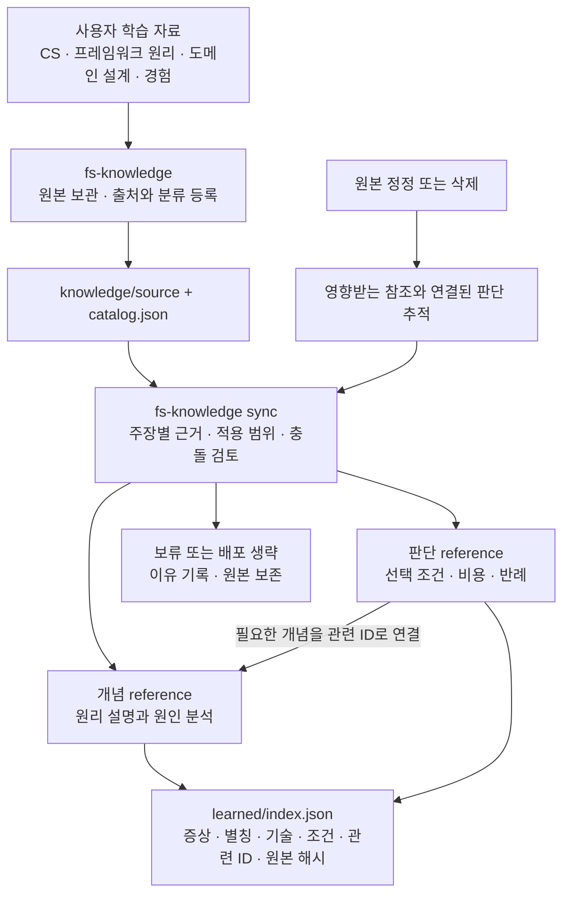
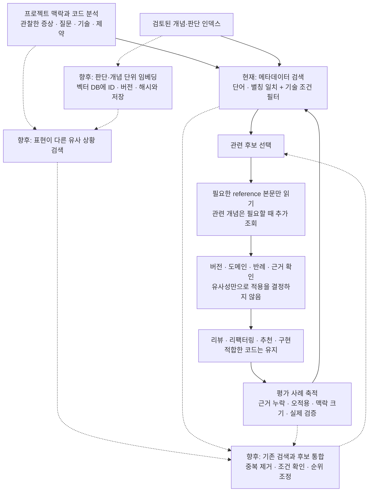

# 배포 지식 참조

`fs-knowledge sync`가 검토한 개념과 조건부 판단을 이곳에 저장합니다. `index.json`에는 검색 메타데이터, 원본 해시, 처리 결과를 기록합니다. 본문은 후보를 고른 뒤 필요한 만큼 읽습니다.

초기 인덱스는 비어 있습니다. 원본 등록만으로 배포된 것으로 간주하지 않으며 sync를 통해 참조와 인덱스를 함께 작성해야 합니다. 원본 자료는 `knowledge/source/`에 보존합니다.

형식과 검토 기준은 [지식 인덱싱 안내](../knowledge-indexing.md)를 참고하세요.

## 지식을 쌓고 사용하는 방식

사용자는 CS, 프레임워크 원리, 프로젝트 경험, 도메인 설계를 자유롭게 기록합니다. FS는 원본을 보존하면서 개념 설명과 조건부 판단을 구분합니다. 모든 개념을 코드 변경 규칙으로 바꾸지는 않습니다.

원본은 공부한 내용의 기록이고, reference는 검토한 내용을 실제 작업에서 읽기 쉽게 정리한 자료입니다. 인덱스는 그중 무엇을 읽을지 찾는 안내 정보입니다. 보류·생략 결과도 인덱스의 outcomes에 기록합니다.

## 현재 검색과 향후 벡터 DB 확장

현재 구현은 JSON 메타데이터의 단어·별칭 검색과 기술 조건 필터를 사용합니다. 아래 점선 경로는 향후 구상이며, 임베딩 생성이나 벡터 DB 연결은 아직 구현하지 않았습니다.

벡터 DB는 다른 표현으로 적힌 관련 근거를 찾는 후보 검색 수단으로 검토합니다. 적용 조건이나 근거 검증을 대신하지 않습니다. 기술 중립적인 CS 지식도 관련 문제에서 찾을 수 있어야 하며, 비슷한 단어가 있다는 이유로 다른 프레임워크의 처방을 적용해서는 안 됩니다.

도입 여부는 실제 사례에서 기존 검색의 누락이 반복되는지, 후보 통합 후 필요한 근거를 더 잘 찾는지로 판단합니다. 같은 평가 사례로 정밀도·재현율, 부적합 결과, 전달 맥락 크기, 지연과 비용을 비교합니다. 검색 품질과 최종 조언의 타당성은 별도로 평가합니다.

현재의 안정적인 ID, 개념/판단 구분, 원본·본문 해시, 적용 조건은 향후 검색 저장소에서도 유지할 계획입니다. 임베딩에는 모델·버전 정보를 추가하고, 원본 변경이나 삭제 시 관련 벡터를 갱신·제거해 오래된 판단이 다시 검색되지 않도록 설계해야 합니다. 외부 임베딩 서비스를 선택한다면 자료 전송 범위와 비용도 별도로 정합니다.
