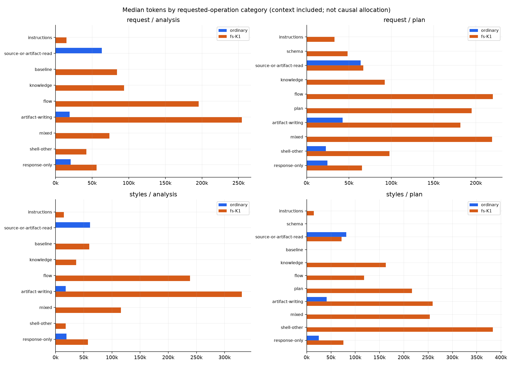

# v14 — 반복 실행에서 토큰이 늘어나는 구간 측정

이 평가는 FS의 설계 우위를 채점하지 않습니다. 각 회차의 FS 버전을 고정하고 **어떤
작업을 수행할 때 문맥과 모델 요청 수가 커지는지** 관찰하여 다음 수정안을 정합니다.
최초 측정 중에는 제품 코드·스킬을 변경하지 않았고, 후속 수정은 별도 회차로 구분했습니다.

## 후속 수정과 재시험 — 2026-10-07

초기 측정을 보존하고 두 번 수정·재시험했습니다. 제품 변경은
[fs-plan](../../../../skills/fs-plan/SKILL.md)과
[흐름 분석 지침](../../../../references/workflows/project-flow-analysis.md)에 한정했습니다.
MCP 검증 코드, 지식, 필수 규칙, 승인·인용·최신성 검사는 변경하지 않았습니다.

1. 관련 초안을 함께 작성하고, 이미 결정된 저장은 같은 호스트 실행에서 순서대로
   수행하도록 했습니다. 성공한 저장의 본문·해시·진단을 재사용하고, 오류/충돌 시
   종속 작업을 중단하며 새 해시로 자동 덮어쓰기하지 않도록 했습니다.
2. 후속 계획에서는 요청하지 않은 기존 설명 문서의 재작성을 하지 않도록 했습니다.
   변경 사항은 새 계획에 기록하고, 필요한 typed flow/finding은 갱신합니다.
   기존 `project.md`의 수동 갱신 원칙과 오래된 근거의 거부는 유지합니다.

**첫 수정만으로는 절감을 확인하지 못했습니다.** 같은 프로젝트·프롬프트·사용자
답변으로 다시 24회 실행했을 때 FS 총 토큰은 14,703,486→15,026,869로 **2.2% 증가**,
비캐시 입력+출력은 968,446→949,045로 2.0% 감소했습니다. 응답 수는 297→293회로
거의 같았고 요청당 입력은 커졌습니다. 일반 AI도 재실행했으며 그 결과와 실패를
[전체 비교](results/2026-10-07-grouped-records/comparison.md)에 보존했습니다.

두 번째 수정은 첫 수정본의 **초기 분석 산출물을 그대로 복제**하고 후속 계획만
프로젝트별 3회, 총 6회 새 대화에서 재실행했습니다. 이전 계획은 전달하지 않았고,
가져온 분석의 사용량은 새 비용에 합산하지 않았습니다.

| FS 후속 계획 6개 합산 | 최초 기준 | 첫 수정 | 추가 보완 |
| --- | ---: | ---: | ---: |
| 총 입력+출력 | 9,144,186 | 10,363,304 | 8,953,538 |
| 비캐시 입력+출력 | 501,882 | 556,712 | 463,810 |
| 모델 응답 수 | 170 | 177 | 169 |
| 구조적 전달 완료 | 6/6 | 6/6 | 6/6 |
| MCP 오류 | 14 | 20 | 18 |

추가 보완은 첫 수정본 대비 총 토큰 **13.6%**, 비캐시 입력+출력 **16.7%**가 감소했습니다.
하지만 최초 기준 대비로는 각각 **2.1%, 7.6% 감소**입니다. 첫 수정에서 늘어난 비용을
회복한 부분을 원래부터의 절감으로 포장하지 않습니다. 최초 기준은 초기 분석도
독립 생성한 실험이며, 정확히 같은 초기 분석을 사용하는 비교는 첫 수정→추가 보완입니다.
추가 보완의 분석 단계까지 다시 실행하지 않았으므로 전체 여정의 절감률도 아닙니다.

| 추가 보완 계획, 각 3회 합산 | 첫 수정 총 토큰 | 추가 보완 총 토큰 | 응답 수 변화 |
| --- | ---: | ---: | ---: |
| request | 5,390,871 | 4,106,932 | 91→79 |
| styles | 4,972,433 | 4,846,606 | 86→90 |

같은 프로젝트 안에서도 증가한 실행이 있습니다. request 2차는 30→37회로 늘었고,
styles는 응답 수 합계가 증가했습니다. 중앙값·범위와 모든 실패 비용을 함께 보며
n=3·캐시·시간 순서·샘플링의 한계를 고려해야 합니다. 확정적인 청구 금액 절감이나
일반 AI 대비 비용 우위를 입증한 결과는 아닙니다.

**의도한 작업 범위의 개선은 확인했습니다.** 첫 수정본은 계획 6개 중 5개에서 이전
분석서를 다시 썼지만 추가 보완에서는 **0/6개**였습니다. 추가 보완의 main 문서도
모두 유지됐고 새 계획의 인용/분석 해시 연결·미승인 상태·빈 연결 진단을 확인했습니다.
실제 계획을 읽어 인증/오류 경계, 입력 보존, 무재시도, 최신 편집 보호, Button의
필수 두 축·네 조합·기본값 금지, Indicator 제외, store/cleanup 조건을 대조했습니다.
이는 핵심 계약 검토이며 모든 설계 문장의 동등성이나 실제 구현 동작의 증명은 아닙니다.

- [첫 수정의 전후 그래프](results/2026-10-07-grouped-records/comparison.png) ·
  [24개 실행 상세](results/2026-10-07-grouped-records/report.html) ·
  [핵심 계약 검토](results/2026-10-07-grouped-records/quality-review.md)
- [추가 보완의 계획 비교](results/2026-10-07-plan-delta/comparison.md) ·
  [6개 실행 상세](results/2026-10-07-plan-delta/report.html) ·
  [최초 기준도 포함한 원값](results/2026-10-07-plan-delta/original-reference.json) ·
  [핵심 계약 검토](results/2026-10-07-plan-delta/quality-review.md)

검증: 관련 회귀 36개, 패키지 검사, 스킬 형식 검사, 요청별 토큰 합계 대조,
HTML 선택기 데이터 전환 검사를 통과했습니다. 이미지도 확인했습니다. 새 모델 실행은
**30회/539개 응답**, 총 **25,393,728토큰**, 비캐시 입력+출력 **1,733,184토큰**입니다.
초기 측정 24회나 가져온 분석을 다시 합산하지 않았고 실패 비용도 제외하지 않았습니다.

첫 수정 시험에서는 일반 AI 계획 4건과 FS 분석 1건이 `.eval/`에 작성되어 루트만
찾는 평가기의 경로 검사에 실패했습니다. 원래 프롬프트의 경로 모호성입니다.
FS 분석 한 건은 실제 생성된 문서를 바이트 그대로 복사하고 기존 실행기의 복구
검사를 거쳐 후속 계획을 실행했습니다. 원래 실패 판정과 비용은 그대로이며, 일반
AI 실패를 FS의 품질 우위로 계산하지 않습니다. [수정 조건과 경로 보정](results/2026-10-07-grouped-records/experiment.json),
[추가 시험의 범위와 실행 순서](results/2026-10-07-plan-delta/experiment.json)를 참고하세요.

남은 병목은 큰 문맥에서의 검증 재시도입니다. 추가 보완 계획에도 MCP 오류가 18건
남았습니다. 다음 후보는 지침을 더 늘리기보다 기존 검증을 보존하면서 독립적인
입력 오류를 한 번에 알리고, 줄 위치/기록 연결 같은 결정적 작업을 도구에서 처리하는
것입니다. 아직 이 서버 변경이나 그 절감 효과를 구현·검증했다고 주장하지 않습니다.

계획만 다시 측정하려면 아래 명령을 사용합니다. source에 보존한 main Git bundle과
초기 분석을 가져오며 `run`만 새 모델 사용량을 발생시킵니다. 새 출력 경로를 지정합니다.

```sh
python3 test/evals/fs-comparison/v14/replan.py prepare /absolute/new/replay --source test/evals/fs-comparison/v14/results/2026-10-07-grouped-records
python3 test/evals/fs-comparison/v14/replan.py run /absolute/new/replay
uv run --with matplotlib==3.11.2 python test/evals/fs-comparison/v14/report.py /absolute/new/replay
uv run --with matplotlib==3.11.2 python test/evals/fs-comparison/v14/compare.py test/evals/fs-comparison/v14/results/2026-10-07-grouped-records /absolute/new/replay --plan-only
```

[오프라인 그래프와 요청별 상세](results/2026-10-07-trajectories/report.html) ·
[수치 표](results/2026-10-07-trajectories/tables.md) ·
[집계 JSON](results/2026-10-07-trajectories/summary.json) ·
[요청별 CSV](results/2026-10-07-trajectories/requests.csv) ·
[사전 고정 프로토콜](protocol.md)

## 최초 실측 결론 — 2026-10-07

두 프로젝트 × 일반/FS × 3회 반복 × 분석/계획, **24개 실행과 380개 모델 응답**을
측정했습니다. 모든 요청별 사용량 합계가 CLI 최종 값과 일치했습니다. FS 버전과
대상 소스가 유지됐고 대화 ID 24개가 모두 다릅니다. 총 16,216,880토큰이며,
비캐시 입력+출력은 1,280,432토큰입니다. 미확인 사용량은 없습니다.

| 전체 12개 단계씩 합산 | 일반 AI | FS | FS/일반 |
| --- | ---: | ---: | ---: |
| 총 입력+출력, 캐시 포함 | 1,513,394 | 14,703,486 | 9.72배 |
| 비캐시 입력+출력 | 311,986 | 968,446 | 3.10배 |
| 모델 응답 수 | 83 | 297 | 3.58배 |
| 응답당 평균 입력 | 17,660 | 49,043 | 2.78배 |
| 구조적 전달 완료 | 11/12 | 12/12 | 설계 품질 점수 아님 |

일반 AI의 한 실패는 계획 파일의 저장 위치 문제입니다. 원문·판정·비용을 그대로
보존했으며, FS 설계 우위로 해석하지 않습니다. 여섯 개의 같은 반복/프로젝트 쌍에서
총 토큰 비율은 **8.44~12.63배**, 비캐시 입력+출력은 **1.62~4.86배**였습니다.
합산 비율과 반복별 범위 모두 비용 차이가 큰 것으로 나타납니다.

**주요 패턴은 요청 수 증가와 큰 입력의 반복 처리입니다.** FS 입력은 전체 FS
토큰의 99.1%입니다. 초안·문서 작성, 흐름 기록, 계획 기록으로 분류한 요청에서
6,838,302토큰(46.5%)이 관측됐습니다. 여기에는 앞서 읽은 문맥도 포함되므로
기록 기능을 없애면 46.5%가 절약된다는 뜻은 아닙니다.

FS 297개 응답 중 117개는 출력 200토큰 이하·입력 40,000토큰 이상이었습니다.
이 구간의 총 처리량은 6,792,313토큰(46.2%)입니다. 작은 저장·수정 요청에도
큰 문맥이 붙는 현상을 확인할 수 있습니다. 이 임계값은 관측을 설명하기 위한
값이며, 짧은 응답 자체를 불필요한 작업으로 판정하지 않습니다.

예를 들어 1차 styles 분석은 26개 응답에 걸쳐 입력이 14,598→62,559토큰으로
커졌습니다. 같은 분석의 응답 수는 2차 14개, 3차 24개였습니다. FS를 수정하지
않았는데도 편차가 있으므로, 1차→2차 감소만 보고 최적화됐다고 할 수 없습니다.

FS MCP 실패는 21건입니다. 기록 키 형식 3건, 인용 위치 5건, 적용 제외 조건 5건,
근거 범위/라우팅 5건, 직접 수정의 계약 근거 1건, 변경된 분석/해시 2건입니다.
오류 신호 뒤 응답은 일반 1개/FS 32개로 표시합니다. 이는 검색 exit 1이나 실행
래퍼 오류도 포함하고, 한 응답 앞에 오류가 여러 개일 수도 있어 MCP 실패 수와
같지 않습니다. **오류 복구만으로 전체 비용 차이를 설명할 수는 없습니다.**

1차 styles 분석의 `get_work_context` 한 응답은 26,347자였으며, 그 안의 routing은
13,299자, context는 9,855자였습니다. routing의 선택적 관계가 7,509자,
context의 필수 규칙이 9,003자입니다. workflow만 빼는 작은 수정으로는 이 응답의
주요 크기를 줄이기 어렵습니다. 글자 수는 토큰 수가 아니며
[전체 응답별 구성](results/2026-10-07-trajectories/context-payloads.json)을 별도 보존합니다.

따라서 우선 검토할 부분은 **기록 작업의 모델 왕복을 줄이고, 커진 문맥을 필요한
범위로 전달하는 것**입니다. FS에 추가된 근거 기록 의무와 평가용 문서 작성도
비용에 포함돼 있습니다. 모든 차이를 낭비로 단정하거나 이번 결과만으로 설계
가치를 부정하지 않습니다. 아래 수정안은 아직 제품에 적용하지 않았습니다.

## 보고서 열기

저장소 루트에서 열 수 있습니다. HTML은 외부 통신 없이 단일 파일로 동작합니다.

```sh
open test/evals/fs-comparison/v14/results/2026-10-07-trajectories/report.html
```

## 그래프 읽는 방법

1. **누적 곡선:** 모델 응답 순서에 따라 입력+출력이 얼마나 누적되는지 봅니다.
   같은 색의 세 선은 독립 반복입니다. 반복 사이를 연결한 개선 추세선이 아닙니다.
2. **분포:** 조건별 중앙값과 최솟값~최댓값입니다. 전달 완료 수를 함께 표시합니다.
3. **요청 수 × 문맥 크기:** 요청이 많아서 비싼지, 요청마다 큰 입력을 다시 처리해서
   비싼지 구분합니다. 실제로는 두 요인이 동시에 작용할 수 있습니다.
4. **작업 분류:** 지식 검색/검토, 흐름 기록, 기준 문서, 계획 저장, 문서 작성 등에서
   관측된 토큰입니다. 한 요청이 여러 작업을 하면 `mixed`로 남깁니다.
5. **실행별 상세:** 선택한 실행의 입력·캐시·출력, 누적량, 오류 신호 뒤의 요청,
   직전 대비 입력 증가와 호출 근거를 볼 수 있습니다.

작업 분류는 **그 모델 요청이 하려던 작업**입니다. 이전 문맥과 앞선 도구 결과를
다시 처리하는 비용도 포함되므로 ‘save 도구 자체가 이 토큰을 소비했다’는 뜻이
아닙니다. 입력 증가도 도구 결과뿐 아니라 직전 출력·시스템 문맥 등의 영향을
포함합니다. 도구 결과 글자 수는 별도 지표이며 토큰으로 환산하지 않았습니다.

작업 분류의 의미:

| 표시 | 의미 |
| --- | --- |
| instructions / schema | 스킬·작업 지침 / 도구 입력 형식 읽기 |
| source-or-artifact-read | 소스 또는 이미 작성된 분석 읽기 |
| baseline | main 기준 소스·문서 조회와 저장 |
| knowledge | 트리거·라우팅·지식 본문 조회 |
| flow | 흐름·개선 항목 조회와 저장 |
| plan | 계획 조회와 저장 |
| artifact-writing | JSON 초안·설명 문서 작성/수정 |
| mixed | 여러 종류의 작업을 한 요청에서 수행 |
| response-only / shell-other / other | 도구 호출 없는 응답 / 다른 셸 작업 / 미분류 |



## 실험 조건

- 기존 v12의 요청/캐시/새 draft 문제와 React/Tailwind/store, 두 프로젝트.
- 일반 AI와 FS 각각 3회, 분석 → 변경 후 계획의 두 단계: 총 24회 실행.
- 요청 모델 `gpt-6-sol`, reasoning `medium`, 단계당 900초, 동시 실행 최대 2개.
- 매 반복·조건은 새 코드 사본. 두 단계도 별도 새 대화이며, 그 실행이 작성한
  분석 파일만 같은 프로젝트의 후속 단계로 전달합니다. 다른 반복 결과는 보지 못합니다.
- FS/일반 AI 모두 같은 프로젝트·계약·후속 사용자 답변. FS는 실제 스킬/MCP/지식과
  근거 기록 의무를 추가로 받습니다. 같지 않은 산출물 의무도 비용 차이의 원인입니다.
- 실행 순서를 고정 seed로 섞고 runtime/소스 해시·격리 검사·실패·산출물을 보존합니다.
- 앱 실행·구현·제품 테스트 비용은 측정하지 않습니다. **분석과 계획 비용**입니다.
  계측 개발과 이 보고서를 작성한 상위 대화의 사용량은 실험 모델 합계에 포함하지 않습니다.
- 대화를 초기화해도 제공자 캐시는 강제로 초기화할 수 없습니다. 따라서 캐시 입력과
  비캐시 입력을 분리합니다. 토큰 배수는 청구 금액 배수가 아닙니다.

## 계측 정확성

CLI는 단계의 최종 합계를 반환합니다. 정확히 그 스레드 ID의 로컬 rollout에서
`token_usage_record`의 요청별 기록을 읽고, 입력·캐시·출력·추론 부분합이 최종
CLI 값과 일치하는지 검사합니다. 중복 응답 ID는 중복 합산하지 않고, 충돌·누락·
불일치는 `unverified`입니다. 추론 토큰은 출력의 일부이므로 별도로 더하지 않습니다.

계정·잔액·rate-limit 값, 비공개 추론 내용, 다른 대화는 산출물에 포함하지 않습니다.
각 실행의 `tokens.json`에는 사용량, 타임스탬프와 도구 호출 메타데이터만 보존합니다.
과거 v13의 6개 실행으로 합계 대조를 먼저 확인했지만, 그것을 새 3회 반복 표본에
섞지 않았습니다.

작업 분류는 원본 호출 메타데이터에서 재현합니다. 스키마 안에서 단순히 언급된
도구 이름을 실제 실행으로 오분류하지 않도록 분석기를 보완했고, 같은 분류 규칙을
모든 실행에 적용했습니다. 원본 사용량과 모델 입력은 그대로입니다.
[분류 보완 기록](results/2026-10-07-trajectories/classification-note.json) 및
`summary.json.classificationSha256`을 참고하세요.

‘오류 뒤’는 직전 도구 출력에서 오류 신호를 관측한 구간입니다. 검색 결과 없음에
따른 exit 1 등도 포함할 수 있으며, 해당 요청 비용 전체를 낭비 비용으로 계산하지
않습니다. MCP 실패 수와 오류 메시지는 별도로 보존합니다. 실패한 MCP의 정확한 메시지를
같은 실행의 도구 출력과 대조하여 오류 위치를 보완합니다. CLI 최종 이벤트만으로
보이지 않던 실행 래퍼의 문법 오류 등도 이 단계 로그에는 남습니다.

## 완료와 비용을 구분

모든 비용은 실패를 포함합니다. 산출물 위치 불일치, 소스 변경, 시간 초과, 근거
저장 미완료 등을 따로 표시합니다. FS 분석은 main 기준 문서와 flow/finding 기록,
FS 계획은 미승인 revision·근거 연결·분석 참조 해시·연결 진단까지 확인합니다.
이 검사는 구조적 전달 확인이며 해석 정확도나 설계 우위의 점수가 아닙니다.

1차 request 일반 AI는 `.eval/plan.md`를 전달했지만 검사기는 프로젝트 루트의
`plan.md`를 요구해 실패했습니다. 원래 프롬프트의 산출물/스크래치 경로 해석 문제가
섞여 있으므로, 이를 FS의 설계 우위로 해석하지 않습니다. 파일과 원래 판정은
보존했고 성공한 회차만 고르거나 프롬프트를 중간 변경하지 않았습니다.

## 재현

FS runtime의 빌드가 준비된 저장소에서 실행합니다. `prepare`는 모델을 호출하지
않으며, `run`이 실제 사용량을 소비합니다. 기존 결과를 덮어쓰지 않습니다.

```sh
npm run build
python3 test/evals/fs-comparison/v14/run.py prepare --output /absolute/new/results
python3 test/evals/fs-comparison/v14/run.py run --output /absolute/new/results
uv run --with matplotlib==3.11.2 python test/evals/fs-comparison/v14/report.py /absolute/new/results
python3 test/evals/fs-comparison/v14/test_tokens.py
node test/evals/fs-comparison/v14/check_report.mjs /absolute/new/results/report.html
```

Matplotlib는 분석용 임시 uv 환경에서 사용하며 FS 제품 의존성에 추가하지 않았습니다.
`charts/*.svg`와 `charts/*.png`도 공유할 수 있습니다. HTML 선택기·데이터 전환은
Node의 최소 DOM 모형으로 검증하고 PNG를 시각 확인합니다. 이 검증을 실제 브라우저
레이아웃·상호작용 검사로 주장하지 않습니다.

n=3은 개선 후보를 찾는 탐색적 측정입니다. 한 모델·두 작은 프로젝트·새 세션
분석/계획이라는 범위가 있으며, 대규모 실제 제품과 오래 이어지는 세션 전체로
일반화하거나 확정적인 개선율을 약속하지 않습니다.

## 최초 측정에서 도출한 수정 후보

규칙·질문·근거 검증을 제거하는 대신, **같은 판단을 전달하고 기록하는 비용**을
먼저 줄입니다. 아래는 당시 도출한 후보입니다. 기록 호출 지침과 문서 재작성 범위의
후속 수정 결과는 위에 기록했으며, 나머지 서버 변경은 아직 적용하지 않았습니다.

| 순서 | 관측 근거 | 검토할 수정 | 유지해야 할 계약 |
| --- | --- | --- | --- |
| 1 | 커진 입력을 매번 처리하면서 작은 초안 수정·흐름 저장을 여러 요청에 나눔 | 관련 초안을 한 번에 작성하고, 이미 결정된 기록 작업은 같은 도구 실행 안에서 순서대로 처리. 기존 호출 조합부터 활용하고 필요할 때만 일괄 저장 API 검토 | 기록별 인용·해시·최신성 검사와 실패 항목 표시. 자동 승인이나 충돌 시 무조건 덮어쓰기 금지 |
| 2 | `get_work_context` 결과에 지식 후보·조사 기준·필수 규칙·선택적 코드 관계가 함께 실림 | 후보와 근거의 식별자·적용 조건은 처음에 전달하고, 선택한 범위의 상세 예제·관계는 필요 시 조회. 변경되지 않은 문맥은 기존 ID 재사용 | 필수 규칙을 모델에서 숨기지 않음. 소스·기준 문서·지식 변경 시 무효화 유지 |
| 3 | 기록 키·줄 번호·근거 범위 오류와, 제외 조건에 해당하는 지식을 적용하려던 재시도 | 형식·인용 위치 같은 결정적 항목은 기존 초안 검증/도구에서 진단을 모아 전달. 입력 도움말도 필요한 필드에 집중. 의미 판단 오류는 실제 조건·제외 근거를 다시 검토 | 줄 위치 보정이 인용 의미의 확인을 대신하지 않음. 제외 조건을 뒤집거나 검증을 생략해 통과시키지 않음 |
| 4 | 구조화된 흐름/개선점과 요약 문서, 평가용 Markdown을 각각 작성 | 이미 저장된 사실은 참조 또는 기계적으로 생성한 요약으로 전달하고, AI는 해석·새 결정에 집중 | `project.md`의 기준 상태와 작업 중 변경을 구분. 사용자 갱신 선택 유지 |

현재도 summary 기본 응답, 상세 조회, `knownContextId`, `draftFile`,
`save_project_context`의 문서 생성은 존재합니다. 이를 새로 도입하면 해결된다는
뜻이 아닙니다. 실제로 선택한 옵션과 갱신 시점, 필수 전달 내용, 호출 횟수를
[요청별 기록](results/2026-10-07-trajectories/requests.csv)에서 확인해 좁혀야 합니다.

연결 코드: [작업 문맥](../../../../src/application/task-context.ts),
[MCP 기록 API](../../../../src/mcp.ts),
[입력 도움말](../../../../scripts/tool-help.mjs),
[흐름 분석 지침](../../../../references/workflows/project-flow-analysis.md).

당시 제안한 다음 검증은 우선 1번만 적용한 FS와 고정 FS를 같은 두 프로젝트·3회
반복으로 비교하는 것이었으며 위 후속 결과에 기록했습니다. 입력+출력, 비캐시 입력+출력, 요청 수, 요청당 입력,
오류 재시도와 전달 완성도를 함께 봅니다. 기록·근거가 빠진 저비용 실행은 개선으로
인정하지 않고 실제 결정·제외 조건 유지 여부도 함께 검토해야 합니다. 우연히 싼
한 번을 선택하지 않고 실패 비용과 반복 범위를 모두 공개합니다.
