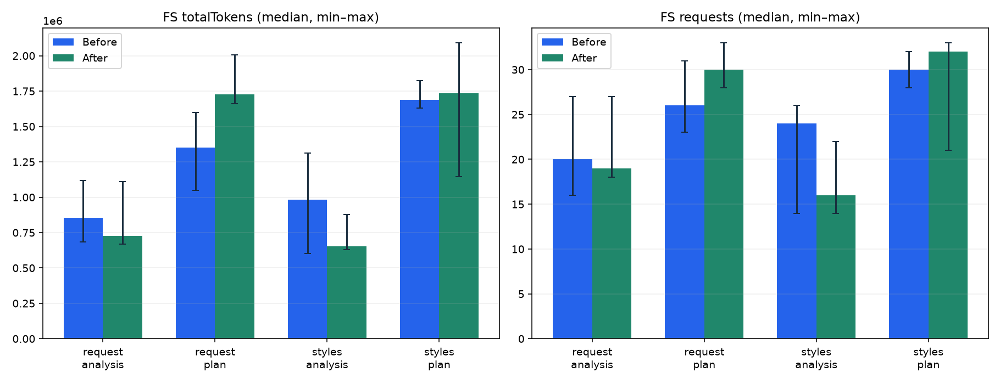

# 기록 호출 통합 전후 비교

선택한 범위의 전체 합계입니다. 실패도 포함합니다. 총 입력에는 캐시가 포함됩니다.

| 조건 | 지표 | 수정 전 | 수정 후 | 변화 |
| --- | --- | ---: | ---: | ---: |
| fs-K1 | 총 입력+출력 | 14,703,486 | 15,026,869 | +2.2% |
| fs-K1 | 비캐시 입력+출력 | 968,446 | 949,045 | -2.0% |
| fs-K1 | 모델 응답 수 | 297 | 293 | -1.3% |
| fs-K1 | 응답당 평균 입력 | 49,043 | 50,802 | +3.6% |
| fs-K1 | 구조적 전달 완료 | 12 | 11 | — |
| fs-K1 | MCP 오류 | 21 | 22 | — |
| ordinary | 총 입력+출력 | 1,513,394 | 1,413,321 | -6.6% |
| ordinary | 비캐시 입력+출력 | 311,986 | 320,329 | +2.7% |
| ordinary | 모델 응답 수 | 83 | 77 | -7.2% |
| ordinary | 응답당 평균 입력 | 17,660 | 17,799 | +0.8% |
| ordinary | 구조적 전달 완료 | 11 | 8 | — |
| ordinary | MCP 오류 | 0 | 0 | — |

## FS 반복 분포

중앙값 [최솟값–최댓값]. 서로 다른 반복의 최선값을 선택하지 않습니다.

| 프로젝트/단계 | 지표 | 수정 전 | 수정 후 |
| --- | --- | --- | --- |
| request/analysis | 총 입력+출력 | 855,729 [683,631–1,118,054] | 725,695 [667,015–1,108,858] |
| request/plan | 총 입력+출력 | 1,352,766 [1,049,991–1,600,911] | 1,725,909 [1,659,422–2,005,540] |
| styles/analysis | 총 입력+출력 | 984,087 [604,269–1,313,530] | 654,852 [628,608–878,537] |
| styles/plan | 총 입력+출력 | 1,686,826 [1,628,299–1,825,393] | 1,733,436 [1,146,922–2,092,075] |
| request/analysis | 모델 응답 수 | 20 [16–27] | 19 [18–27] |
| request/plan | 모델 응답 수 | 26 [23–31] | 30 [28–33] |
| styles/analysis | 모델 응답 수 | 24 [14–26] | 16 [14–22] |
| styles/plan | 모델 응답 수 | 30 [28–32] | 32 [21–33] |

일반 AI도 같은 시기에 다시 실행한 대조군입니다.
전후 실험은 시간 순서대로 실행했으므로 제공자 캐시·샘플링 변화와 수정 효과를 완전히 분리할 수 없습니다. 완료 수는 구조 검사이며 설계 정확도 점수가 아닙니다.
