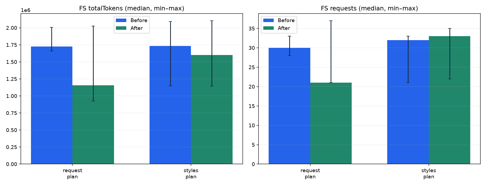

# 기존 분석서 보존 지침의 계획 단계 비교

선택한 범위의 전체 합계입니다. 실패도 포함합니다. 총 입력에는 캐시가 포함됩니다.

| 조건 | 지표 | 수정 전 | 수정 후 | 변화 |
| --- | --- | ---: | ---: | ---: |
| fs-K1 | 총 입력+출력 | 10,363,304 | 8,953,538 | -13.6% |
| fs-K1 | 비캐시 입력+출력 | 556,712 | 463,810 | -16.7% |
| fs-K1 | 모델 응답 수 | 177 | 169 | -4.5% |
| fs-K1 | 응답당 평균 입력 | 58,092 | 52,580 | -9.5% |
| fs-K1 | 구조적 전달 완료 | 6 | 6 | — |
| fs-K1 | MCP 오류 | 20 | 18 | — |

## FS 반복 분포

중앙값 [최솟값–최댓값]. 서로 다른 반복의 최선값을 선택하지 않습니다.

| 프로젝트/단계 | 지표 | 수정 전 | 수정 후 |
| --- | --- | --- | --- |
| request/plan | 총 입력+출력 | 1,725,909 [1,659,422–2,005,540] | 1,154,795 [926,836–2,025,301] |
| styles/plan | 총 입력+출력 | 1,733,436 [1,146,922–2,092,075] | 1,599,954 [1,142,569–2,104,083] |
| request/plan | 모델 응답 수 | 30 [28–33] | 21 [21–37] |
| styles/plan | 모델 응답 수 | 32 [21–33] | 33 [22–35] |

FS 계획만 재실행한 부분 비교입니다. 초기 분석의 토큰을 새 사용량으로 합산하지 않습니다.
전후 실험은 시간 순서대로 실행했으므로 제공자 캐시·샘플링 변화와 수정 효과를 완전히 분리할 수 없습니다. 완료 수는 구조 검사이며 설계 정확도 점수가 아닙니다.
